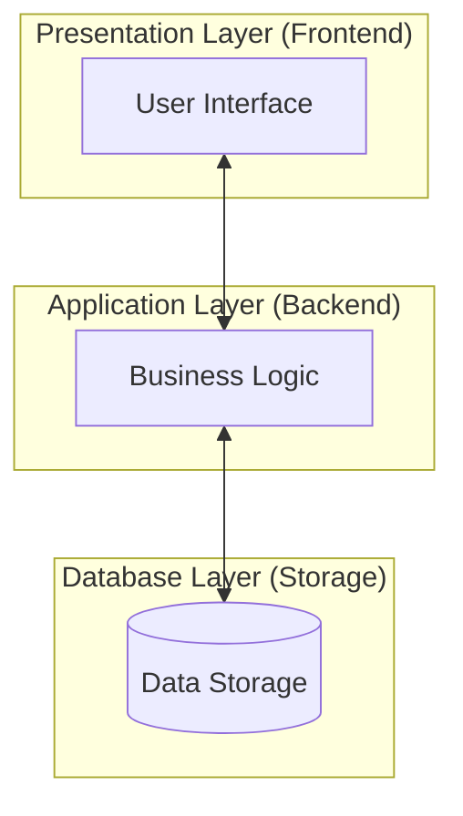
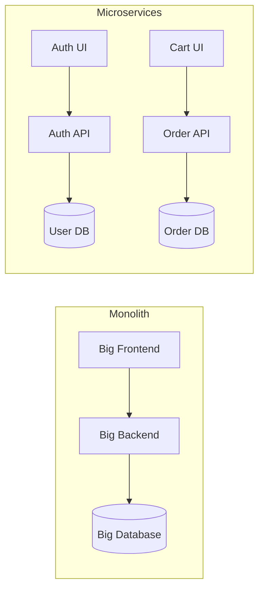
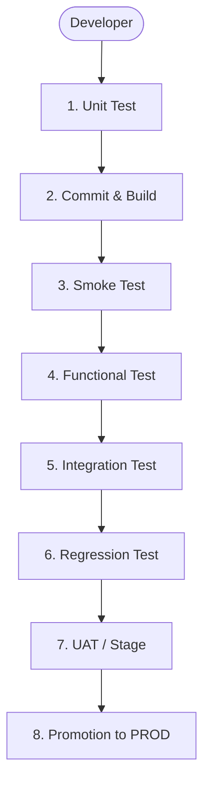

# DevOps Pre-Requisites & 3-Tier Architecture Guide

A comprehensive guide for DevOps Engineers covering mandatory skills, tools, workflows, and architectural patterns required for building production-grade systems on cloud platforms.

## Table of Contents
- [Overview](#overview)
- [Core Prerequisites](#core-prerequisites)
  - [Technical Skills](#technical-skills)
- [Standard Workflow](#standard-workflow)
  - [The Complete DevOps Lifecycle](#the-complete-devops-lifecycle)
- [Key Metrics](#key-metrics)
  - [DORA Metrics](#dora-metrics)
- [3-Tier Architecture](#3-tier-architecture)
  - [Overview](#overview-1)
  - [Layers and Responsibilities](#layers-and-responsibilities)
  - [Microservices Breakdown](#microservices-breakdown)
  - [From Monolith to Microservices](#from-monolith-to-microservices)
- [Development Workflow](#development-workflow)
- [Deployment Strategy](#deployment-strategy)
- [Key Benefits](#key-benefits)
- [Tech Stack](#tech-stack)
- [Microservice Feature Flow (End-to-End)](#microservice-feature-flow-end-to-end)

---

## Overview

DevOps Engineers bridge the gap between development and operations through automation, infrastructure as code (IaC), and continuous delivery. This guide details the mandatory skills, tools, and end-to-end workflow required for production-grade systems on AWS/cloud platforms.

## Core Prerequisites

### Technical Skills Every DevOps Engineer Must Master

| Category | Must-Have Skills | Why Important |
| :--- | :--- | :--- |
| **Cloud** | AWS (VPC, EC2, RDS, EFS), Terraform | 90% of jobs require cloud IaC. |
| **CI/CD** | Jenkins/GitHub Actions, Docker | Automates deployments 10x faster. |
| **Scripting** | Python, Bash, YAML | Essential for gluing tools together. |
| **Containers** | Docker, Kubernetes basics | Modern app deployment standard. |
| **Monitoring** | CloudWatch, Prometheus, Grafana | Ensures high availability (99.9% uptime). |
| **Security** | IAM, Trivy, tfsec | Integrates compliance and vulnerability management early. |

---

## Standard Workflow

### The Complete DevOps Lifecycle (Day 0 → Day 2)

1. **Design** → Cloud-native architecture (HA, DR, scalability)
2. **Code** → Infrastructure as Code (Terraform modules)
3. **Build** → Golden AMIs/Images (Packer + Ansible)
4. **Test** → Security scanning (Trivy, Checkov)
5. **Deploy** → CI/CD pipeline (Jenkins/GitHub Actions)
6. **Monitor** → Observability (metrics, logs, alerts)
7. **Optimize** → Cost, performance, auto-scaling

> **Requirement:** Requirements → IaC (Terraform) → CI/CD (Jenkins) → Production → Monitor → Iterate

---

## Key Metrics

### DORA Metrics for DevOps Performance

| Metric | Target | Measurement |
| :--- | :--- | :--- |
| **Deployment Frequency** | Daily | Number of deployments per week. |
| **Lead Time for Changes** | < 1 day | Time from commit to production. |
| **Change Failure Rate** | < 15% | Percentage of failed deployments. |
| **Mean Time to Recovery** | < 1 hour | Time to resolve incidents. |

### Personal Metrics to Track
- **Terraform apply time:** < 5 min
- **Pipeline success rate:** > 95%
- **Infrastructure cost savings:** Track monthly

---

## 3-Tier Architecture

### Overview

Traditional 3-Tier Design has evolved into Microservices. The fundamental logic remains: split the application into **Presentation**, **Application**, and **Database** layers.



Three-layer architecture is a foundational pattern that splits an application into three clear layers: **Presentation**, **Application**, and **Data**. Each layer has its own responsibility and communicates only with the layer next to it, which makes systems easier to understand, change, and scale.

### Layers and Responsibilities

#### Presentation Layer (Frontend)
User interface and communication layer.
- Displays data to users and collects their input (forms, buttons, pages).
- Performs basic client-side validation and formatting (for example, mandatory fields, date format).
- **Goal:** Show information clearly and collect user input, without containing business rules.

#### Application Layer (Backend / Business Logic)
Business logic layer that decides how the system should behave.
- Receives requests from the presentation layer, validates them, applies business rules, and coordinates with the data layer.
- Sends appropriate responses back to the presentation layer (success/failure, calculated results, messages).
- **Goal:** Act as the brain of the system, processing every request according to rules and workflows.

#### Data Layer (Database / Storage)
Responsible for storing and retrieving all application data.
- Persists processed information sent by the application layer and returns it when requested.
- Ensures data integrity, consistency, and performance through indexes, queries, and backups.
- **Goal:** Provide reliable, efficient storage while hiding database complexity from upper layers.

---

### Microservices Breakdown

In a modern microservices architecture, these layers are distributed across independent services.

#### 1. Presentation Layer (Frontend Services)
- **User Authentication Service**: Login/logout, JWT tokens.
- **Dashboard Service**: Metrics visualization, charts.
- **API Gateway Service**: Routes requests to backend services.
- **Static Content Service**: CSS/JS/images delivery.

```text
Frontend Services:
├── auth-frontend (React/Vue)
├── dashboard-ui (React)
├── api-gateway (Kong/Nginx)
└── static-cdn (S3/CloudFront)
```

#### 2. Application Layer (Backend Services)
- **User Management Service**: CRUD users/profiles.
- **Order Processing Service**: Order workflows.
- **Payment Service**: Payment gateway integration.
- **Notification Service**: Email/SMS alerts.

```text
Backend Services:
├── user-service (Node.js/Spring Boot)
├── order-service (Python/Go)
├── payment-service (Java)
└── notification-service (Node.js)
```

#### 3. Database Layer (Storage Services)
- **User DB Service**: PostgreSQL + connection pooling.
- **Order DB Service**: MongoDB for documents.
- **Cache Service**: Redis for sessions.
- **Audit Log Service**: Elasticsearch.

```text
Storage Services:
├── user-postgres (RDS)
├── order-mongo (DocumentDB)
├── redis-cache (ElastiCache)
└── audit-elasticsearch (OpenSearch)
```

---

### From Monolith to Microservices

In a traditional 3‑tier system, each layer might be one big application. In modern systems, each layer is split into small, focused services so that development, testing, and release can happen independently.



#### Examles
- **Presentation Layer Microservices**: Account Service UI, Search Service UI.
- **Application Layer Microservices**: Trending Now Service, Watch Again Service.
- **Data Layer Microservices**: Separate databases/schemas per service to avoid bottlenecks.

---

## Development Workflow

### Independent Service Development Cycle:

1. **Develop** → Single service in isolation (mock dependencies).
2. **Test** → Unit/Integration tests for that service.
3. **CI** → Jenkins/GitHub Actions pipeline per service.
4. **Release** → Deploy only the changed service (zero downtime).

```text
Service: payment-service
git commit → jenkins build → docker build → deploy to EKS → notify team
   ↓ (5 min total)
Other services continue running unaffected
```

### Example Jenkins Pipeline (per Service)
```groovy
pipeline {
  agent any
  stages {
    stage('Test') { steps { sh 'pytest' } }
    stage('Build') { steps { sh 'docker build -t payment:v1.2 .' } }
    stage('Deploy') { steps { sh 'kubectl apply -f k8s/payment.yaml' } }
  }
}
```

---

## Deployment Strategy

### Independent Service Releases:

| Service Changed | Action | Impact | Rollback Time |
| :--- | :--- | :--- | :--- |
| `payment-service` | Deploy v1.2 → EKS | Payments only affected | < 2 min |
| `user-service` | No change | ✅ Running | None |
| `frontend` | No change | ✅ Running | None |

### Blue-Green Deployment per Service:
`Active: payment-v1.1` → `New: payment-v1.2` → `Switch traffic` → `Delete v1.1`

**Traffic Management:** API Gateway + Service Mesh (Istio) routes to correct versions.

---

## Key Benefits

1. **Independent Development:** 10x faster team velocity
2. **Isolated Testing:** Service-specific test suites
3. **Selective Releases:** Deploy only what changed (95% less risk)
4. **Scalability:** Scale payment-service independently during peak
5. **Fault Isolation:** User-service crash doesn't affect payments

### Metrics Achieved:

| Metric | Value | Industry Elite |
| :--- | :--- | :--- |
| **Deployment Frequency** | 15x/day/service | Multiple/day |
| **Service Uptime** | 99.95% | 99.99% |
| **Change Failure Rate** | 2% | < 15% |

---

## Tech Stack

- **Infra:** Terraform (VPC/EKS/RDS/ElastiCache)
- **CI/CD:** Jenkins (per service) + GitHub Actions
- **Containers:** Docker + Kubernetes (EKS)
- **API Gateway:** Kong + Istio Service Mesh
- **Monitoring:** Prometheus + Grafana + CloudWatch
- **Logging:** FluentBit → OpenSearch
- **Security:** Trivy → IAM → WAF

---

## Microservice Feature Flow (End-to-End)

For each microservice in a layer (e.g., Account Service), a feature goes through a clear sequence from code to production.


So in a microservice architecture, development, testing, and validation happen independently for each microservice, ensuring faster releases, better isolation, and higher reliability.

### 1. Developer Work and Unit Testing
- **Action:** Developers work on files related to a specific feature (technically preferred over "functionality").
- **Action:** Run unit tests only for modified units.
- **Definition:** Unit test = "Did the code I just changed for this feature work correctly on my machine?"

#### In a microservice architecture, developers build features within a microservice, validate those features using unit testing, and only then commit the code to Git, ensuring stability before the CI/CD pipeline starts. Note: A "Unit" refers only to the specific files modified (e.g., 10 out of 1000), not the entire codebase.

### 2. Commit to Git and Build (Create Product)
- **Action:** Commit changes; CI/CD pipeline builds the artifact (jar, war, dll, tar, zip, image, etc.).
- **Idea:** Source code is raw material; build artifact is the finished product.

#### Unit testing validates only the files modified by a developer for a specific feature, while CI pipelines re-run those tests centrally, followed by integration testing, packaging, and deployment to ensure stability in a multi-developer microservice environment.

### 3. Smoke Test (Sanity Check After Build)
- **Action:** Quick high-level checks (does it start?).
- **Goal:** Verify build integrity before QA.
- **Analogy:** Checking all items are in the bag before delivery.

#### Smoke testing is a test that we perform after taking all the source code and building it into a product, to verify whether the product has been created correctly and is stable enough for further testing. Smoke testing is performed after the build process, once all the code is packaged into a product. It is a basic sanity check to ensure the product is created properly and can be handed over to QA for functional testing.

### 4. Functional Testing (Per Microservice, Per Feature)
- **Action:** QA validates the specific feature change.
- **Key Point:** Functional test = "Does this feature behave exactly as expected?"

#### Functional testing validates individual features of a microservice against business requirements after the build is created and smoke-tested.

### 5. Integration Testing (All Modified Services Together)
- **Action:** Test combined build of all changed services.
- **Focus:** Integration test = "Do all new pieces work together?"

#### Integration testing ensures that all individually tested microservices and features work together correctly as a single product.

### 6. Regression Testing (Old + New Features)
- **Action:** Verify existing features still work with new changes.
- **Definition:** Regression test = "Did the new changes break anything old?"

#### Regression testing validates that newly added or modified features do not impact existing functionality of the product.

### 7. UAT / Stage Environment (Real-Like Check)
- **Action:** User Acceptance Testing (UAT) in a prod-like environment (often called **Pre-Production** or **Beta Test**).
- **Question:** "Is this release ready for real customers?"

#### User Acceptance Testing validates the product from a real customer’s point of view in a production-like environment, ensuring the product is truly ready for release.

#### Performance testing ensures the product not only works correctly, but also performs reliably under real-world load before it is approved in UAT and released to production.

#### Security testing ensures the product is secure and protected against vulnerabilities before it is approved in UAT and released to production.

#### Load testing ensures the product can handle the expected load before it is approved in UAT and released to production.

### 8. Promotion to PROD (Release)
- **Action:** Promote the verified artifact from the Beta/Stage environment to Production.
- **Method:** Blue-Green or Rolling deployment.