# CI/CD Pipeline and Microservice Lifecycle

## Overview

This document describes the continuous integration and continuous deployment (CI/CD) pipeline for microservices, including the branching strategy, testing phases, and containerization approach. This represents a complete software delivery ecosystem where code changes are automatically built, tested, and deployed across multiple environments.

---

## CI/CD Fundamentals

### What is CI/CD?

**Continuous Integration (CI):**
- Developers merge code changes frequently (multiple times per day)
- Each merge triggers automated build and tests
- Fast feedback on code quality issues
- Reduces integration problems ("integration hell")

**Continuous Deployment (CD):**
- Automated promotion of validated builds to production
- Eliminates manual deployment bottlenecks
- Reduces human errors
- Enables rapid feature delivery

**Continuous Testing (CT):**
- Automated tests at every stage
- Unit, integration, regression, and UAT tests
- Quality gates prevent defects from reaching production

### Pipeline Overview

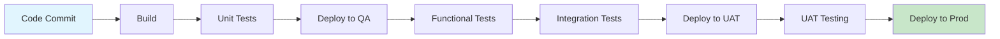

**Pipeline Flow:**
```
Continuous Development (Dev) → Continuous Integration (CI) → Continuous Deployment (CD) → Continuous Testing (QA)
```

### Key Benefits

| Benefit | Impact |
|---------|--------|
| **Faster Release Cycle** | Features reach customers quicker |
| **Reduced Risk** | Smaller, frequent changes easier to rollback |
| **Higher Quality** | Automated tests catch bugs early |
| **Less Manual Work** | Automation reduces human error |
| **Better Feedback** | Developers know immediately if code is good |
| **Scalability** | Same process works for many microservices |

---

## Continuous Delivery: Automation Architecture

### Understanding Continuous Delivery Across Multiple Microservices

**Continuous Delivery** is not just about one build and one deployment. It's about **automating the entire pipeline at every branch level, with each microservice having its own complete CI/CD setup**.

### The Automation Flow: From Code Push to Production

```
Developer pushes code → Automatic Build → Automatic Deployment → Automatic Testing
     ↓                      ↓                    ↓                      ↓
Code Commit        Compile Code          Deploy to Env         Run Tests
                   Run Unit Tests        Start Service         Generate Report
                   Scan Code             Health Check          Trigger Next Stage
```

### Multiple Builds Across Branching Strategy

**How many times do we BUILD in the branching model?**

```
┌─────────────────────────────────────────────────────────────────┐
│                       THREE BUILDS PER MICROSERVICE             │
├─────────────────────────────────────────────────────────────────┤
│                                                                 │
│  1️⃣  FEATURE BRANCH BUILD                                      │
│      When: Developer pushes code to feature/xyz                 │
│      Trigger: Webhook on Git push                              │
│      Frequency: Multiple times per day                          │
│      Scope: Build + Unit Tests only                             │
│      Deployment: Deploy to QA for Functional Testing            │
│                                                                 │
│  2️⃣  INTEGRATION BRANCH BUILD                                  │
│      When: Feature merged to integration branch                 │
│      Trigger: Pull Request merge                               │
│      Frequency: Once per integration cycle (daily)              │
│      Scope: Build + Integration + Regression Tests              │
│      Deployment: Deploy same build to QA multiple times         │
│                                                                 │
│  3️⃣  RELEASE BRANCH BUILD                                      │
│      When: Integration merged to release branch                 │
│      Trigger: Release branch creation/merge                    │
│      Frequency: Once per release cycle (weekly/monthly)         │
│      Scope: Build + All Tests + Version Tag                    │
│      Deployment: Deploy same build to UAT, then Production      │
│                                                                 │
└─────────────────────────────────────────────────────────────────┘
```

### Multiple Deployments Across Testing Phases

**How many times do we DEPLOY?**

```
┌─────────────────────────────────────────────────────────────────┐
│                   FIVE DEPLOYMENTS PER BUILD                    │
├─────────────────────────────────────────────────────────────────┤
│                                                                 │
│  1️⃣  DEPLOY for FUNCTIONAL TESTING (Feature Branch)            │
│      Environment: QA                                            │
│      When: Feature branch build succeeds                        │
│      Owner: QA Team                                             │
│      Testing: Feature functionality                             │
│                                                                 │
│  2️⃣  DEPLOY for INTEGRATION TESTING (Integration Branch)       │
│      Environment: QA (same)                                     │
│      When: Integration branch build succeeds                    │
│      Owner: QA Team                                             │
│      Build: SAME BUILD as #1 (reused)                           │
│      Testing: Cross-feature interactions                        │
│                                                                 │
│  3️⃣  DEPLOY for REGRESSION TESTING (Integration Branch)        │
│      Environment: QA (same)                                     │
│      When: Integration testing passes                           │
│      Owner: QA Team                                             │
│      Build: SAME BUILD as #1 & #2 (reused again)               │
│      Testing: Full application functionality                    │
│                                                                 │
│  4️⃣  DEPLOY for UAT TESTING (Release Branch)                   │
│      Environment: UAT/Staging                                   │
│      When: Release branch build succeeds                        │
│      Owner: QA/Business Users                                   │
│      Build: SAME BUILD as #1, #2, #3 (reused 3 times)          │
│      Testing: User Acceptance Testing                           │
│                                                                 │
│  5️⃣  DEPLOY to PRODUCTION (Release Branch)                     │
│      Environment: Production                                    │
│      When: UAT passes + Manual approval                         │
│      Owner: Release Manager                                     │
│      Build: SAME BUILD as all above (reused 4 times)            │
│      Deployment: Blue-Green or Canary strategy                  │
│      Impact: Live for all customers                             │
│                                                                 │
└─────────────────────────────────────────────────────────────────┘
```

### Three CI/CD Pipelines Per Microservice

Since we have 3 builds (Feature, Integration, Release) and 5 deployments, we need **3 separate CI/CD pipelines**:

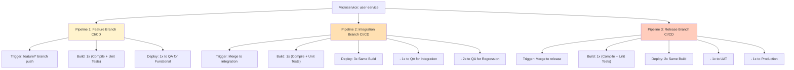

### CI vs CD: The Key Difference

```
┌──────────────────────────────────────────────────────────────┐
│                   CI (Continuous Integration)                │
├──────────────────────────────────────────────────────────────┤
│ • Build the code                                             │
│ • Run unit tests                                             │
│ • Run static code analysis                                   │
│ • Scan for vulnerabilities                                   │
│ • Result: "Code is ready to test"                            │
│ • Frequency: Every code push (multiple/day)                  │
│ • Pipelines: 1 per branch (3 total for our model)            │
└──────────────────────────────────────────────────────────────┘

┌──────────────────────────────────────────────────────────────┐
│               CD (Continuous Deployment)                     │
├──────────────────────────────────────────────────────────────┤
│ • Take built artifact (Docker image)                         │
│ • Deploy to target environment                               │
│ • Run integration/regression/UAT tests                        │
│ • Promote to next environment                                │
│ • Result: "Build tested and ready for production"            │
│ • Frequency: On demand or per schedule                       │
│ • Deployments: 5 per release cycle                           │
└──────────────────────────────────────────────────────────────┘
```

### "Build Once, Deploy Multiple Times" In Detail

This is the **core principle** that reduces build time and ensures consistency:

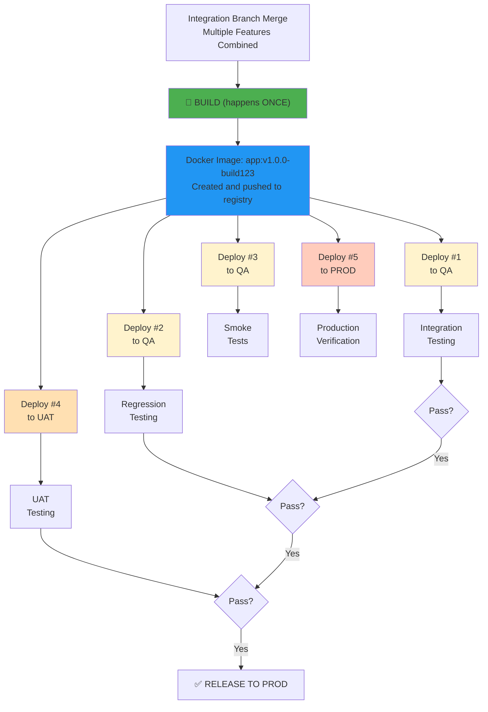

**Benefits of "Build Once, Deploy Multiple Times":**
- ✅ Same code tested multiple times (consistency)
- ✅ No "works on my build but not yours" problems
- ✅ Faster overall cycle (no rebuild overhead)
- ✅ Predictable, reliable releases
- ✅ Docker image is immutable (can't change after build)

### Complete Automation Workflow Across Branches

```
┌─────────────────────────────────────────────────────────────────────┐
│          FEATURE BRANCH: Build Once, Deploy Once                    │
├─────────────────────────────────────────────────────────────────────┤
│                                                                     │
│  Developer Action:                                                  │
│  git push feature/user-auth                                        │
│        ↓                                                            │
│  Automatic Trigger (Webhook):                                      │
│  Jenkins Job: build-feature-user-auth                              │
│        ↓                                                            │
│  Pipeline Steps:                                                   │
│  1. Checkout code from feature/user-auth                           │
│  2. Build: npm install, npm run build                              │
│  3. Unit Tests: npm run test:unit                                  │
│  4. Scan: sonar-scanner, snyk scan                                 │
│  5. Docker: docker build -t user-auth:feat-12345 .                │
│  6. Push: docker push to registry                                  │
│  7. Deploy: kubectl apply -f deploy-qa.yml                         │
│  8. Wait: kubectl rollout status deployment/user-auth -n qa        │
│  9. Health: curl http://user-auth-qa/health                        │
│        ↓                                                            │
│  Result: Build deployed to QA                                      │
│  QA Team: Can now run Functional Tests                             │
│                                                                     │
└─────────────────────────────────────────────────────────────────────┘

┌─────────────────────────────────────────────────────────────────────┐
│   INTEGRATION BRANCH: Build Once, Deploy Multiple Times             │
├─────────────────────────────────────────────────────────────────────┤
│                                                                     │
│  Developer Action:                                                  │
│  Merge feature/user-auth to integration (PR approved)              │
│        ↓                                                            │
│  Automatic Trigger (Webhook on merge):                             │
│  Jenkins Job: build-integration                                    │
│        ↓                                                            │
│  Build Step (happens ONCE):                                        │
│  1. Checkout code from integration branch                          │
│  2. Build: npm install, npm run build                              │
│  3. Unit Tests: npm run test:unit                                  │
│  4. Scan: sonar-scanner, snyk scan                                 │
│  5. Docker: docker build -t user-auth:int-v1.0.0-b456 .           │
│  6. Push: docker push to registry                                  │
│        ↓                                                            │
│  🎯 NOW THE SAME BUILD GETS DEPLOYED 3 TIMES 🎯                   │
│        ↓                                                            │
│  DEPLOYMENT #1 - Integration Testing:                              │
│  1. kubectl set image deployment/user-auth                         │
│     user-auth=registry/user-auth:int-v1.0.0-b456 -n qa             │
│  2. Run: npm run test:integration                                  │
│  3. Result: "Integration tests PASS ✅"                             │
│        ↓ (same image, different test)                              │
│  DEPLOYMENT #2 - Regression Testing:                               │
│  1. kubectl set image deployment/user-auth                         │
│     user-auth=registry/user-auth:int-v1.0.0-b456 -n qa             │
│  2. Run: npm run test:regression                                   │
│  3. Result: "Regression tests PASS ✅"                              │
│        ↓ (same image, different test)                              │
│  DEPLOYMENT #3 - Smoke Tests:                                      │
│  1. kubectl set image deployment/user-auth                         │
│     user-auth=registry/user-auth:int-v1.0.0-b456 -n qa             │
│  2. Run: curl http://user-auth-qa/health                           │
│  3. Result: "Smoke tests PASS ✅"                                   │
│        ↓                                                            │
│  All Tests Passed: Ready for Release Branch                        │
│                                                                     │
└─────────────────────────────────────────────────────────────────────┘

┌─────────────────────────────────────────────────────────────────────┐
│    RELEASE BRANCH: Build Once, Deploy to UAT & Production           │
├─────────────────────────────────────────────────────────────────────┤
│                                                                     │
│  Developer Action:                                                  │
│  Merge integration to release/v1.0.0 (Release Manager)             │
│        ↓                                                            │
│  Automatic Trigger (Webhook on merge):                             │
│  Jenkins Job: build-release                                        │
│        ↓                                                            │
│  Build Step (happens ONCE):                                        │
│  1. Checkout code from release/v1.0.0                              │
│  2. Build: npm install, npm run build                              │
│  3. All Tests: npm run test:full                                   │
│  4. Security Scan: trivy image, checkov scan                       │
│  5. Docker: docker build -t user-auth:v1.0.0 .                    │
│  6. Push: docker push to registry                                  │
│  7. Tag: git tag -a v1.0.0                                         │
│        ↓                                                            │
│  🎯 NOW THE SAME BUILD GETS DEPLOYED 2 TIMES 🎯                   │
│        ↓                                                            │
│  DEPLOYMENT #4 - UAT Environment:                                  │
│  1. kubectl set image deployment/user-auth                         │
│     user-auth=registry/user-auth:v1.0.0 -n uat                    │
│  2. QA Team: Runs UAT scenarios                                    │
│  3. Business Users: Validates functionality                        │
│  4. Result: "UAT APPROVED ✅" or "UAT FAILED ❌"                   │
│        ↓ (if approved)                                             │
│  DEPLOYMENT #5 - Production Environment:                           │
│  1. Blue-Green: Deploy to "green" environment                      │
│  2. kubectl set image deployment/user-auth-green                   │
│     user-auth=registry/user-auth:v1.0.0 -n prod                  │
│  3. Health Checks: curl http://user-auth-prod/health               │
│  4. Switch Traffic: kubectl patch service user-auth                │
│     -p '{"spec":{"selector":{"version":"green"}}}' -n prod         │
│  5. Result: "RELEASED TO ALL CUSTOMERS 🎉"                         │
│        ↓                                                            │
│  If Issues Occur:                                                  │
│  Instant Rollback: Switch traffic back to blue (old version)       │
│                                                                     │
└─────────────────────────────────────────────────────────────────────┘
```

### Scaling Across Multiple Microservices

When you have 5 microservices:

```
┌────────────────────────────────────────────────────────────────────┐
│  5 Microservices × 3 CI/CD Pipelines = 15 Total Pipelines          │
├────────────────────────────────────────────────────────────────────┤
│                                                                    │
│  Microservice 1: Frontend (Node.js + React)                        │
│    ├─ Pipeline 1.1: Feature branch CI/CD                           │
│    ├─ Pipeline 1.2: Integration branch CI/CD                       │
│    └─ Pipeline 1.3: Release branch CI/CD                           │
│                                                                    │
│  Microservice 2: Backend (Spring Boot)                             │
│    ├─ Pipeline 2.1: Feature branch CI/CD                           │
│    ├─ Pipeline 2.2: Integration branch CI/CD                       │
│    └─ Pipeline 2.3: Release branch CI/CD                           │
│                                                                    │
│  Microservice 3: Payment Service (Python)                          │
│    ├─ Pipeline 3.1: Feature branch CI/CD                           │
│    ├─ Pipeline 3.2: Integration branch CI/CD                       │
│    └─ Pipeline 3.3: Release branch CI/CD                           │
│                                                                    │
│  Microservice 4: Auth Service (Go)                                 │
│    ├─ Pipeline 4.1: Feature branch CI/CD                           │
│    ├─ Pipeline 4.2: Integration branch CI/CD                       │
│    └─ Pipeline 4.3: Release branch CI/CD                           │
│                                                                    │
│  Microservice 5: Database (Migration Service)                      │
│    ├─ Pipeline 5.1: Feature branch CI/CD                           │
│    ├─ Pipeline 5.2: Integration branch CI/CD                       │
│    └─ Pipeline 5.3: Release branch CI/CD                           │
│                                                                    │
│  Parallel Execution:                                              │
│  All pipelines run independently and simultaneously                │
│  If Service 1 build fails, Services 2-5 continue                   │
│  Total time: Max of individual service times (not sum)             │
│                                                                    │
└────────────────────────────────────────────────────────────────────┘
```

### Build & Deployment Count Summary

**For a single microservice:**

| Stage | Builds | Deployments | Purpose |
|-------|--------|-------------|---------|
| **Feature Branch** | 1 | 1 | Test new feature |
| **Integration Branch** | 1 | 3 | Test multiple features together |
| **Release Branch** | 1 | 2 | Test UAT + Production release |
| **TOTAL** | **3** | **6** | **Complete CI/CD** |

**For 5 microservices in parallel:**
- Total CI Pipelines: 15 (3 per service)
- Total Builds per release: 5 (one per service)
- Total Deployments: 30 (6 per service)
- All running simultaneously and independently

---

The project follows a **three-branch model** that ensures code quality, parallel development, and safe production releases.

### Why Three Branches?

| Branch | Purpose | Stability | Update Frequency |
|--------|---------|-----------|------------------|
| **Feature** | Individual feature development | Unstable (experimental) | Multiple/day |
| **Integration** | Combine & validate features | Moderate | Daily |
| **Release** | Production-ready code | Stable (always deployable) | Weekly/monthly |

### Git Flow Visualization

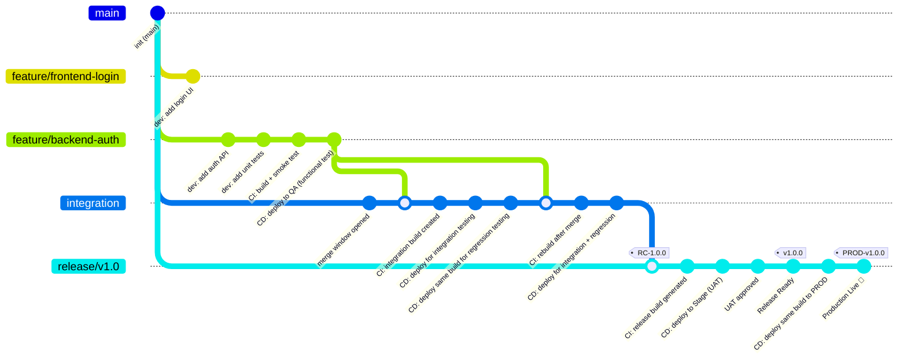


**Sequential Flow (Text Format):**
```
Developer starts feature branch
    ↓
Local Development: Write code + unit tests
    ↓
Git push to feature/user-auth
    ↓
Webhook triggers CI Pipeline
    ↓
[AUTOMATED]
Stage 1: Compile code
Stage 2: Run unit tests
Stage 3: Static analysis (Sonarqube)
Stage 4: Security scan (Trivy, Checkov)
Stage 5: Build Docker image
Stage 6: Push to registry
Stage 7: Deploy to QA
Stage 8: Smoke tests
    ↓
QA Environment Ready (feature-user-auth-b123)
    ↓
[MANUAL - QA TEAM]
Functional testing (user workflows)
Performance testing (if applicable)
    ↓
Bug fixes (if needed) → Developer pushes to same branch → Pipeline re-runs
    ↓
Code Review (senior dev approves)
    ↓
✅ Merge to Integration Branch
```

**Key Characteristics:**

| Aspect | Details |
|--------|---------|
| **Branch** | `feature/<name>` (e.g., `feature/user-auth`) |
| **Lifetime** | 2-5 days of development |
| **Builds** | 1 build per feature (can trigger multiple times if bugs found) |
| **Deployments** | 1 deployment to QA (feature branch env) |
| **Tests** | Unit + Functional + Security |
| **Artifacts** | Docker image tagged with build number |
| **Duration** | 5-30 minutes for full pipeline |
| **Approval** | PR approval + QA sign-off before merge |

**CI Pipeline Stages (Automated):**

1. **Compile** – Resolve dependencies, compile code
2. **Unit Tests** – Run tests, check coverage (min 70%)
3. **Static Analysis** – Sonarqube quality gates
4. **Security Scan** – Trivy + Checkov for vulnerabilities
5. **Build Docker** – Create container image
6. **Registry Push** – Store image in Docker registry
7. **Deploy QA** – Automated deployment to QA
8. **Smoke Tests** – Verify deployment succeeded

**Example Build ID & Image Tag:**
```
Feature Branch: feature/user-authentication
Build ID: b123 (auto-incremented)
Docker Image: my-service:feature-user-authentication-b123
Registry: docker.io/company/my-service:feature-user-authentication-b123
```


---

### Integration Branch Workflow

**Timeline:** Each integration cycle takes 1-2 days (multiple features combined)

**Purpose:** Validate that multiple features work together correctly

**Detailed Flow - "Build Once, Deploy Multiple Times" Pattern:**

```mermaid
flowchart TD
    Start["🔀 Multiple Features Ready<br/>feature/auth ✅<br/>feature/payment ✅<br/>feature/dashboard ✅"] --> Merge["🤝 Merge to Integration<br/>git checkout integration<br/>git merge feature/auth<br/>git merge feature/payment<br/>git merge feature/dashboard<br/>git push origin integration"]
    
    Merge --> WebHook["⚡ Webhook Triggered<br/>(Integration branch push)"]
    WebHook --> Pipeline["🔄 CI Pipeline Starts<br/>(Same 8-stage pipeline)"]
    
    Pipeline --> Stages["📦 Stages 1-8: Standard Build<br/>✓ Compile<br/>✓ Unit tests<br/>✓ Static analysis<br/>✓ Security scan<br/>✓ Build Docker image<br/>✓ Push to registry<br/>✓ Deploy to QA (Smoke tests)"]
    
    Stages --> ImageCreated["🐳 SINGLE Docker Image Created<br/>service:integration-b456<br/>(contains auth+payment+dashboard)"]
    ImageCreated --> Registry["📦 Image Stored in Registry<br/>docker.io/company/service:integration-b456<br/>(immutable, same for all tests)"]
    
    Registry --> DeployDeploy1["🚀 DEPLOY #1<br/>(Same image, different test suite)"]
    Registry --> DeployDeploy2["🚀 DEPLOY #2<br/>(Same image, different test suite)"]
    Registry --> DeployDeploy3["🚀 DEPLOY #3<br/>(Same image, different test suite)"]
    
    DeployDeploy1 --> TestDeploy1["🧪 Integration Testing #1<br/>- Cross-feature workflows<br/>- Auth → Payment → Dashboard flow<br/>- API interactions<br/>- Database state consistency"]
    
    DeployDeploy2 --> TestDeploy2["🔄 Regression Testing #2<br/>- Existing functionality<br/>- Old features still work<br/>- No breaking changes<br/>- Performance benchmarks"]
    
    DeployDeploy3 --> TestDeploy3["🔗 End-to-End Testing #3<br/>- Full user workflows<br/>- Login → Purchase → Export<br/>- Edge cases<br/>- Multi-user scenarios"]
    
    TestDeploy1 --> Result1{"Integration<br/>Tests Pass?"}
    TestDeploy2 --> Result2{"Regression<br/>Tests Pass?"}
    TestDeploy3 --> Result3{"E2E Tests<br/>Pass?"}
    
    Result1 -->|No| BugFound["🐛 Bug Found<br/>in integration<br/>between features"]
    Result2 -->|No| BugFound
    Result3 -->|No| BugFound
    
    BugFound --> NotifyDev["📢 Notify Developers<br/>Which feature caused issue"]
    NotifyDev --> FixFeature["👨‍💻 Developer Fixes<br/>in feature branch<br/>(e.g., feature/auth)"]
    FixFeature --> RemergeFeature["🤝 Re-merge Feature<br/>to Integration"]
    RemergeFeature --> Pipeline
    
    Result1 -->|Yes| Result2
    Result2 -->|Yes| Result3
    Result3 -->|Yes| AllPass["✅ ALL TESTS PASSED<br/>Integration Cycle Complete"]
    
    AllPass --> ReadyRelease["🎉 Ready for Release Branch<br/>Image: service:integration-b456<br/>Candidates: feature/auth, feature/payment, feature/dashboard"]
    ReadyRelease --> End["📋 Sign-off<br/>Ready for UAT & Production"]
    
    style Start fill:#e3f2fd,stroke:#1976d2,stroke-width:2px
    style ImageCreated fill:#fff3cd,stroke:#ff9800,stroke-width:2px
    style DeployDeploy1 fill:#c8e6c9,stroke:#4caf50,stroke-width:2px
    style DeployDeploy2 fill:#c8e6c9,stroke:#4caf50,stroke-width:2px
    style DeployDeploy3 fill:#c8e6c9,stroke:#4caf50,stroke-width:2px
    style TestDeploy1 fill:#f1f8e9,stroke:#689f38,stroke-width:2px
    style TestDeploy2 fill:#f1f8e9,stroke:#689f38,stroke-width:2px
    style TestDeploy3 fill:#f1f8e9,stroke:#689f38,stroke-width:2px
    style BugFound fill:#ffcdd2,stroke:#c62828,stroke-width:2px
    style AllPass fill:#d4edda,stroke:#388e3c,stroke-width:2px
    style End fill:#d4edda,stroke:#388e3c,stroke-width:2px
```

**The "Build Once, Deploy Multiple Times" Philosophy:**

```
┌─────────────────────────────────────────────────────────────┐
│           SINGLE BUILD PROCESS (Once)                       │
├─────────────────────────────────────────────────────────────┤
│  Compile → Test → Scan → Build Docker → Push to Registry   │
│           Result: service:integration-b456                 │
└─────────────────────────────────────────────────────────────┘
         ↓
    ┌────┴────┬────────────┬────────────┐
    ↓         ↓            ↓            ↓
┌────────┐ ┌────────────┐ ┌──────────┐ ┌──────────┐
│Deploy#1│ │Deploy#2    │ │Deploy#3  │ │Deploy#4  │
│Integ   │ │Regression  │ │E2E Tests │ │Load Test │
│Tests   │ │Tests       │ │(Optional)│ │(Optional)│
└────────┘ └────────────┘ └──────────┘ └──────────┘
    ↓         ↓            ↓            ↓
  Same Docker Image (immutable, guaranteed identical)
  tested in different ways → Maximum confidence
```

**Why This Pattern Matters:**

| Benefit | Explanation |
|---------|-------------|
| **Consistency** | Same code tested everywhere = no "works in QA, not prod" |
| **Speed** | Build once, reuse for all tests = faster feedback |
| **Reliability** | Test the exact artifact that goes to production |
| **Cost** | Fewer build resources = lower infrastructure costs |
| **Traceability** | Single image ID linked to all test results |
| **Confidence** | Comprehensive testing with identical artifact |

**Sequential Timeline:**

```
Day 1, 9:00 AM:   Developers merge 3 features to integration
Day 1, 9:05 AM:   Webhook triggers pipeline
Day 1, 9:25 AM:   Single Docker image created: service:integration-b456
Day 1, 9:30 AM:   [PARALLEL] Deploy to QA env #1, #2, #3
Day 1, 9:45 AM:   [PARALLEL] Integration testing, Regression testing, E2E testing
Day 1, 11:00 AM:  All tests pass ✅
Day 1, 11:30 AM:  Image promoted to Release candidate
Day 1, 2:00 PM:   Image deployed to UAT
Day 1, 5:00 PM:   UAT testing complete, ready for production
Day 2, 10:00 AM:  Blue-Green deployment to production
```

**Example Integration Cycle in Practice:**

```
Integration Branch Merges:
  feature/user-auth (login, password reset) ✅
  feature/payment (checkout, payment processing) ✅
  feature/dashboard (analytics, reports) ✅

Build Sequence (Automated):
  1. Compile: Resolve dependencies for all 3 features
  2. Unit Tests: 150 tests (50 per feature)
  3. Security Scan: Check for vulnerabilities in combined code
  4. Build: Single Docker image with all 3 features
  5. Tag: service:integration-b456 (b = build, 456 = auto-incremented)
  6. Registry: docker.io/company/service:integration-b456

Deployment Sequence (Parallel):
  Deploy #1 (QA Env 1): Integration Testing
    - Login user → Purchase item → View dashboard
    - Auth system talks to payment system
    - Payment system updates dashboard analytics
    - ✅ All interactions work

  Deploy #2 (QA Env 2): Regression Testing
    - Old features still work (customer listing, reports)
    - No breaking changes
    - Performance: response time < 200ms
    - ✅ All regression tests pass

  Deploy #3 (QA Env 3): E2E & Load Testing
    - Simulate 100 concurrent users
    - Each user: login → purchase → view dashboard
    - No errors, all tests pass
    - ✅ System handles load

Result: Image promoted to Release Branch
```

**Testing Matrix for Integration Cycle:**

| Test Type | Focus | Duration | Environment |
|-----------|-------|----------|-------------|
| **Integration Tests** | Feature interactions, APIs, data flow | 15 mins | QA Env 1 |
| **Regression Tests** | Existing features, no breaking changes | 20 mins | QA Env 2 |
| **E2E Tests** | Complete user workflows, multi-user | 25 mins | QA Env 3 |
| **Performance Tests** | Load, response time, resource usage | 10 mins | QA Env 3 |
| **Security Tests** | Vulnerability scan (Trivy, Checkov) | 5 mins | Build stage |

**Total Integration Cycle: ~1 hour from merge to ready for release** 🚀
Day 1 Evening: Build & Regression Testing
Day 2 Morning: All tests pass
Day 2 Afternoon: Merge to release branch
```

**Example Git Commands:**
```bash
# On integration branch, multiple features have been merged
git checkout integration
git log --oneline
# Shows commits from:
#   feature/payment
#   feature/user-auth
#   feature/dashboard

# Build and test
# If issues found, developers go back to their feature branches

git checkout feature/payment
# Fix the bug
git push origin feature/payment

# Merge the fix back to integration
git checkout integration
git merge feature/payment
git push origin integration
# This triggers the pipeline again
```

---

### Release Branch Workflow

**Timeline:** Release cycle takes 2-5 days (UAT + production deployment)

**Purpose:** Final validation before production release

**Detailed Flow - Production-Ready Release Process:**

```mermaid
flowchart TD
    Start["✅ Integration Tests Complete<br/>Image: service:integration-b456"] --> CreateRelease["🏷️ Create Release Branch<br/>git checkout -b release/v1.2.3 integration"]
    
    CreateRelease --> BumpVersion["📝 Version Bump<br/>- Update package.json/pom.xml<br/>- Version: v1.2.3<br/>- Update CHANGELOG<br/>- git commit + push"]
    
    BumpVersion --> WebHook["⚡ Webhook Triggered<br/>(Release branch push)"]
    WebHook --> Pipeline["🔄 CI Pipeline Starts"]
    
    Pipeline --> Stages["📦 Build Stages (1-8)<br/>Compile → Tests → Scan → Build"]
    Stages --> VersionedImage["🐳 Versioned Docker Image<br/>service:v1.2.3<br/>(tagged with semantic version)"]
    
    VersionedImage --> Registry["📦 Push to Registry<br/>docker.io/company/service:v1.2.3<br/>(production-ready artifact)"]
    Registry --> DeployUAT["🚀 Deploy to UAT Environment<br/>(Staging/Pre-prod)"]
    
    DeployUAT --> UATReady["✅ UAT Environment Ready<br/>service:v1.2.3 running on staging"]
    UATReady --> ManualGate["⛔ MANUAL APPROVAL GATE<br/>Business Team Reviews"]
    
    ManualGate --> BusinessTest["🧪 User Acceptance Testing<br/>- Product owner validates features<br/>- Real business workflows<br/>- Performance acceptable?<br/>- All functionality working?<br/>- Duration: 1-3 days"]
    
    BusinessTest --> UATResult{"Business<br/>Approves?"}
    UATResult -->|No| UATReject["🚫 Issues Found<br/>- Return to development<br/>- Fix in feature branches<br/>- Re-merge to integration<br/>- Re-tag release"]
    UATReject --> Start
    
    UATResult -->|Yes| UATSign["✅ UAT Sign-Off<br/>Product owner approves release"]
    UATSign --> DeployProd["🚀 BLUE-GREEN DEPLOYMENT<br/>to Production"]
    
    DeployProd --> BlueGreen["🔄 Blue-Green Strategy<br/><br/>BEFORE:<br/>Blue Env: v1.2.2 (current)<br/>Green Env: idle<br/><br/>DEPLOYMENT:<br/>Deploy v1.2.3 to Green<br/>Run production smoke tests"]
    
    BlueGreen --> ProdSmoke["🧪 Production Smoke Tests<br/>(Same image as UAT)<br/>- Health check API<br/>- Critical workflows<br/>- Database connectivity<br/>- Cache validation<br/>- Duration: 5-10 mins"]
    
    ProdSmoke --> SmokeResult{"Smoke Tests<br/>Pass?"}
    
    SmokeResult -->|No| Rollback["🔄 ROLLBACK to v1.2.2<br/>- Blue Env stays production<br/>- Green Env marked for investigation<br/>- Incident post-mortem"]
    Rollback --> Investigate["🔍 Investigation<br/>- Check logs, metrics, traces<br/>- Identify root cause<br/>- Fix issue<br/>- Prepare v1.2.4 patch"]
    Investigate --> Start
    
    SmokeResult -->|Yes| SwitchTraffic["🔀 SWITCH TRAFFIC<br/>Blue → Green<br/>(All traffic to v1.2.3)"]
    SwitchTraffic --> Released["🎉 RELEASE COMPLETE<br/>v1.2.3 in Production"]
    
    Released --> GitTag["📌 Create Git Tag<br/>git tag -a v1.2.3<br/>git push origin v1.2.3"]
    GitTag --> Cleanup["🧹 Cleanup<br/>- Delete release branch<br/>- Archive build artifacts<br/>- Update release notes"]
    Cleanup --> Monitor["📊 Production Monitoring<br/>- Watch metrics & logs<br/>- Alert on anomalies<br/>- Performance tracking"]
    Monitor --> Success["✅ Release Successful<br/>v1.2.3 running in production"]
    
    style Start fill:#e3f2fd,stroke:#1976d2,stroke-width:2px
    style ManualGate fill:#fff3cd,stroke:#f57c00,stroke-width:3px
    style DeployProd fill:#f3e5f5,stroke:#7b1fa2,stroke-width:2px
    style BlueGreen fill:#ffe0b2,stroke:#ff6f00,stroke-width:2px
    style SwitchTraffic fill:#c8e6c9,stroke:#2e7d32,stroke-width:2px
    style Released fill:#d4edda,stroke:#388e3c,stroke-width:3px
    style Rollback fill:#ffcdd2,stroke:#c62828,stroke-width:2px
    style Success fill:#d4edda,stroke:#388e3c,stroke-width:2px
```

**Sequential Release Timeline:**

```
Day 1, 10:00 AM:  Merge integration → release branch
Day 1, 10:05 AM:  CI Pipeline triggers (versioned build)
Day 1, 10:30 AM:  Docker image created: service:v1.2.3
Day 1, 10:40 AM:  Deploy to UAT environment
Day 1, 10:50 AM:  Smoke tests pass on UAT
Day 1, 11:00 AM:  UAT environment ready for business testing
Day 1-3:          Business team performs UAT
Day 3, 4:00 PM:   ✅ UAT approved by product owner
Day 3, 5:00 PM:   Blue-Green deployment starts
Day 3, 5:15 PM:   service:v1.2.3 deployed to Green environment
Day 3, 5:30 PM:   Production smoke tests run
Day 3, 5:35 PM:   ✅ All smoke tests pass
Day 3, 5:45 PM:   Traffic switched from Blue to Green
Day 3, 6:00 PM:   🎉 v1.2.3 live in production
```

**The Three Docker Images in Release Cycle:**

| Image | Tag | Environment | Duration | Purpose |
|-------|-----|-------------|----------|---------|
| **Integration Image** | `service:integration-b456` | QA (Multi-deploy) | Days 1-2 | Integration testing, verified |
| **Release Image** | `service:v1.2.3` | UAT + Prod | Days 3-∞ | Final release, versioned |
| **Previous Release** | `service:v1.2.2` | Prod (Blue) | Until rollback | Rollback candidate |

**Blue-Green Deployment in Detail:**

```
BEFORE RELEASE (5:00 PM):
┌──────────────────┐           ┌──────────────────┐
│  Blue (Active)   │           │   Green (Idle)   │
│  v1.2.2          │           │   (empty)        │
│  ← 100% traffic  │           │                  │
└──────────────────┘           └──────────────────┘

DEPLOYMENT PHASE (5:00-5:30 PM):
┌──────────────────┐           ┌──────────────────┐
│  Blue (Active)   │           │   Green (Deploy) │
│  v1.2.2          │           │   v1.2.3         │
│  ← 100% traffic  │           │   (smoke testing)│
└──────────────────┘           └──────────────────┘

POST-DEPLOYMENT (5:45 PM - Success):
┌──────────────────┐           ┌──────────────────┐
│  Blue (Standby)  │           │  Green (Active)  │
│  v1.2.2          │           │  v1.2.3          │
│                  │           │  ← 100% traffic  │
└──────────────────┘           └──────────────────┘

[Now Green is live, Blue ready for instant rollback]
```

**Release Branch Protection:**

```
Protections on release/* branches:
✓ Require PR review (minimum 2 approvals)
✓ Require CI checks to pass
✓ Dismiss stale PR reviews on new commits
✓ Require status checks to pass before merge
✓ Require branches to be up to date before merge
✓ Restrict who can push to release branch
```

**UAT Approval Gate - What Gets Checked:**

```
Product Owner Checklist:
☑️ Feature A works as specified
☑️ Feature B works as specified  
☑️ Feature C works as specified
☑️ No regressions in existing features
☑️ Performance acceptable (< 200ms response time)
☑️ No critical bugs
☑️ User workflows complete (login → action → logout)
☑️ Data integrity maintained
☑️ UI/UX meets requirements
☑️ Business logic correct

Result: Signed off for production ✅
```

**Handling Release Branch Bugs:**

```
Scenario: Bug found during UAT

Flow:
1. Bug reported in service:v1.2.3 on UAT
2. Bug is NOT in production yet (still v1.2.2)
3. Developer fixes in feature branch
4. Feature branch merged back to integration
5. Integration branch re-tested
6. Integration re-merged to release (updated code)
7. Release branch re-tagged: v1.2.3 (updated)
8. New Docker image: service:v1.2.3 (rebuilt)
9. UAT testing repeats with new image
10. If successful, proceed to production

Key: Version tag stays same (v1.2.3), but code is fixed
     Release branch reset to latest integration code
```

**Git Commands for Release:**

```bash
# Create release branch
git checkout -b release/v1.2.3 integration

# Update version and changelog
# Edit package.json or pom.xml
# Update CHANGELOG.md
git add package.json CHANGELOG.md
git commit -m "Bump version to 1.2.3"
git push origin release/v1.2.3

# [Deployment happens through CI/CD]
# [UAT testing]
# [Production approval]

# After successful production deployment
git checkout main
git merge --no-ff release/v1.2.3 -m "Release v1.2.3"

# Create git tag for release
git tag -a v1.2.3 -m "Release version 1.2.3"
git tag -a v1.2.3 -m "Release notes:
- Feature A: User authentication
- Feature B: Payment processing
- Feature C: Dashboard analytics
- Bugfixes: 5 issues resolved"

# Push tag to remote
git push origin v1.2.3

# Delete release branch
git push origin --delete release/v1.2.3
git branch -d release/v1.2.3
```

**Release Success Criteria:**

| Check | Status | Notes |
|-------|--------|-------|
| **CI Pipeline** | ✅ Pass | All 8 build stages successful |
| **Docker Image** | ✅ Created | service:v1.2.3 in registry |
| **UAT Deploy** | ✅ Success | Image runs in staging |
| **UAT Smoke Tests** | ✅ Pass | Health checks pass |
| **UAT Business Testing** | ✅ Approved | Product owner signed off |
| **Production Deploy** | ✅ Success | Blue-Green deployment complete |
| **Prod Smoke Tests** | ✅ Pass | Critical paths verified |
| **Traffic Switch** | ✅ Complete | v1.2.3 receiving 100% traffic |
| **Post-Release** | 🔍 Monitoring | Metrics & logs watched for 24h |
| **Release Tag** | ✅ Created | git tag v1.2.3 pushed |

**Release Readiness Checklist:**

Before merging to release branch:
- ✅ All feature branches merged and tested (integration)
- ✅ Integration branch fully tested (all 3 test types)
- ✅ No known critical bugs
- ✅ Performance metrics acceptable
- ✅ Security scan passed (no critical vulnerabilities)
- ✅ Documentation updated
- ✅ Release notes prepared
- ✅ Rollback plan documented
- ✅ On-call engineer briefed
- ✅ Monitoring alerts configured

---

---

## Testing Phases

### Testing Pyramid

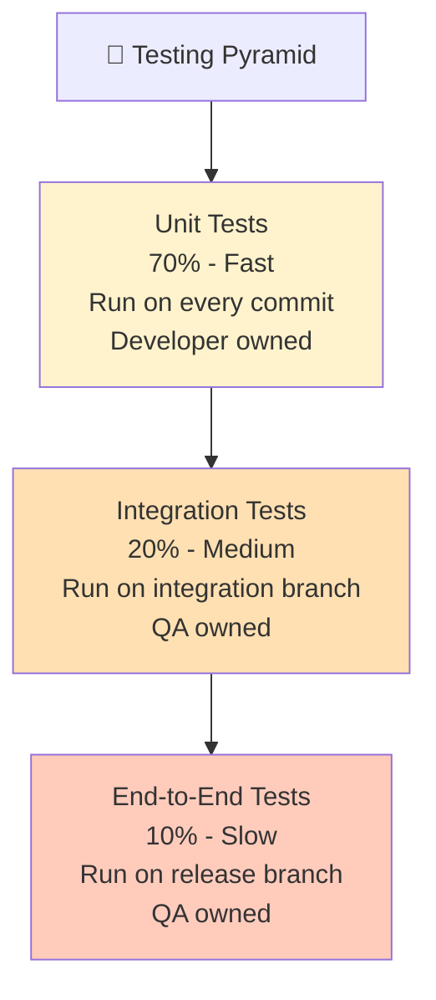

### Detailed Testing Breakdown

| Phase | Branch | Owner | When | Description | Tools |
|-------|--------|-------|------|-------------|-------|
| **Unit Test** | Feature | Developer | Every commit | Individual component testing | Jest, Mocha, JUnit |
| **Functional Test** | Feature | QA | After build | Feature functionality validation | Selenium, Playwright |
| **Integration Test** | Integration | QA | After merge | Cross-feature interaction testing | Postman, API tests |
| **Regression Test** | Integration | QA | After integration | Full app functionality validation | Automated test suites |
| **UAT** | Release | QA/Customer | Before prod | User acceptance validation | Manual + automated |
| **Smoke Test** | All | Automation | After deploy | Critical path validation | API tests, health checks |
| **Performance** | UAT/Prod | Performance team | Before/after release | Load and stress testing | JMeter, LoadRunner |
| **Security** | All | Security team | Before prod | Vulnerability scanning | OWASP, SonarQube |

### Test Execution Flow

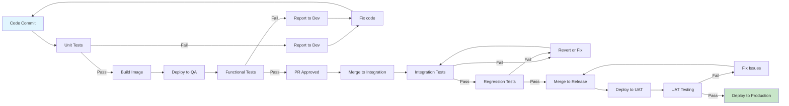

### Test Quality Metrics

```
Unit Test Success Rate: > 95% (should rarely fail)
Functional Test Pass Rate: 90%+ (before prod)
Regression Test Pass Rate: 100% (must be clean before release)
Production Incidents: < 5% of deployments (goal)
Time to Detect Bugs: Seconds (via automation)
Time to Fix & Redeploy: < 1 hour
```

---

## Containerization Strategy

### Why Containers?

| Benefit | Description |
|---------|-------------|
| **Consistency** | Same container works in dev, QA, staging, production |
| **Isolation** | Application doesn't affect host system |
| **Scalability** | Easy to spin up multiple instances |
| **Reproducibility** | Code + dependencies sealed in image |
| **Deployment Speed** | Milliseconds to start a container |

### Docker Image Build Process

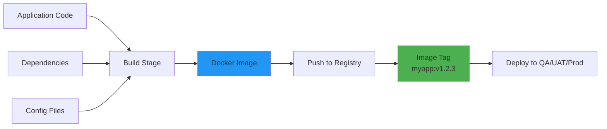

### Docker Image Layers

```dockerfile
# Layer 1: Base OS (Ubuntu, Alpine, etc.)
FROM ubuntu:20.04

# Layer 2: System dependencies
RUN apt-get install -y curl git

# Layer 3: Runtime (Node.js, Java, Python)
RUN curl -fsSL https://deb.nodesource.com/setup_16.x | bash
RUN apt-get install -y nodejs

# Layer 4: Application code
COPY . /app
WORKDIR /app

# Layer 5: Dependencies
RUN npm install

# Layer 6: Start application
CMD ["npm", "start"]
```

**Each layer creates a cache point** - layers only rebuild if source changes.

### Two-Image Strategy

**1. Platform Base Image (Hardened)**
```dockerfile
# security-base:v1
FROM ubuntu:20.04

# Hardening steps
RUN apt-get update && apt-get install -y \
    curl \
    git \
    ca-certificates

# Remove unnecessary packages
RUN apt-get remove -y sudo

# Security scanning
RUN trivy image --severity HIGH,CRITICAL .
```

**2. Application Image (Built on Base)**
```dockerfile
# Inherits from hardened base
FROM security-base:v1

COPY . /app
WORKDIR /app
RUN npm install
CMD ["npm", "start"]
```

**Benefits:**
- Base image hardened and scanned once
- All application images inherit security
- Faster builds (reuse base)
- Consistent security across all apps

### Image Tagging Strategy

```bash
# Development build (temporary)
myapp:latest
myapp:dev-12345  # Commit hash

# Feature testing
myapp:feature/user-auth
myapp:qa-20240212

# Integration testing
myapp:integration-v1.0.0-build123

# Production releases (permanent)
myapp:v1.0.0
myapp:v1.0.1
myapp:v1.1.0
```

### Image Scanning & Security

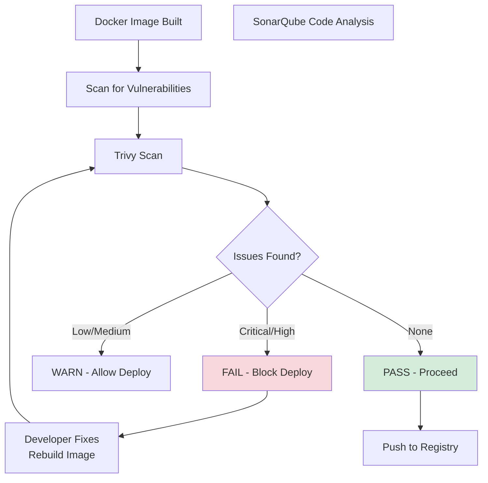

### Container Registry Management

**Registry Purposes:**
- **Development Registry**: Latest builds, frequent cleanup
- **Production Registry**: Release versions, retention policy
- **Backup Registry**: Disaster recovery

**Cleanup Policies:**
```
Dev images: Keep last 5, delete others
QA images: Keep last 10, delete > 30 days old
Prod images: Keep all releases permanently
Untagged images: Delete after 7 days
```

---

## Microservice Architecture

### Microservices
| Service | Type | Technology |
|---------|------|------------|
| Front-end | Web Application | Node.js |
| Back-end | API Service | Spring Boot |

## Microservice Architecture

### Product Microservices

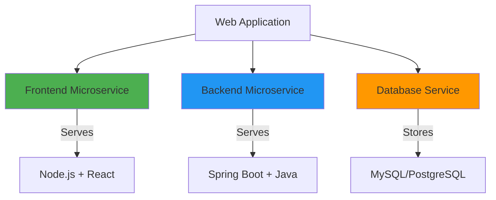

| Service | Type | Technology | Responsibility |
|---------|------|-----------|-----------------|
| **Frontend** | Web Application | Node.js + React/Vue | User Interface, Client-side logic |
| **Backend** | API Service | Spring Boot (Java) | Business logic, API endpoints |
| **Database** | Data Store | MySQL/PostgreSQL | Data persistence |

### Independent CI/CD Pipeline per Microservice

Each microservice has its own:
- Git repository (or separate folder with own pipeline)
- Build pipeline
- Container image
- Testing suite
- Deployment schedule

**Advantages:**
- Teams work independently
- No blocking between services
- Different languages/frameworks per service
- Different release schedules possible

### Microservice Deployment Coordination

```
Frontend v2.0 Ready ✅
    ↓
Backend v1.8 Ready ✅
    ↓
Deploy Frontend to Prod
    ↓
Deploy Backend to Prod
    ↓
Both running and communicating ✅
```

---

## Environment Promotion Strategy

### Four-Tier Environment Pyramid

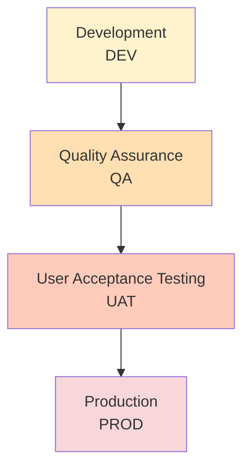

### Environment Characteristics

| Environment | Purpose | Data | Users | Risk | Rollback |
|-------------|---------|------|-------|------|----------|
| **DEV** | Feature development | Fake/test | Developers | None | N/A |
| **QA** | Testing new builds | Fake/test | QA team | Low | Any time |
| **UAT** | Customer validation | Real-like | QA/Customers | Low | Any time |
| **PROD** | Live application | Real | All users | High | Via rollback procedure |

### Promotion Rules

```
Code must pass:
Feature Branch:
  ✅ Unit tests
  ✅ Functional tests
  ✅ Code review

Integration Branch:
  ✅ Integration tests
  ✅ Regression tests

Release Branch:
  ✅ UAT approval
  ✅ Security scan
  ✅ Performance test

THEN: Deploy to Production
```

---

## Pipeline Orchestration with Jenkins/GitHub Actions

### Automated Pipeline Example (Jenkins)

```groovy
pipeline {
    agent any
    
    environment {
        DOCKER_REGISTRY = "registry.company.com"
        APP_NAME = "user-service"
        GIT_REPO = "git@github.com:company/user-service.git"
    }
    
    stages {
        stage('Checkout') {
            steps {
                git branch: '${BRANCH_NAME}', url: "${GIT_REPO}"
            }
        }
        
        stage('Build') {
            steps {
                sh '''
                    npm install
                    npm run build
                '''
            }
        }
        
        stage('Unit Tests') {
            steps {
                sh 'npm run test:unit'
                junit 'test-results/**/*.xml'
            }
        }
        
        stage('Code Quality') {
            steps {
                sh 'sonar-scanner'
            }
        }
        
        stage('Build Docker Image') {
            steps {
                sh '''
                    docker build -t ${DOCKER_REGISTRY}/${APP_NAME}:${BUILD_NUMBER} .
                    docker push ${DOCKER_REGISTRY}/${APP_NAME}:${BUILD_NUMBER}
                '''
            }
        }
        
        stage('Deploy to QA') {
            when {
                branch 'feature/*'
            }
            steps {
                sh '''
                    kubectl set image deployment/user-service \
                        user-service=${DOCKER_REGISTRY}/${APP_NAME}:${BUILD_NUMBER} \
                        -n qa
                    kubectl rollout status deployment/user-service -n qa
                '''
            }
        }
        
        stage('Functional Tests') {
            when {
                branch 'feature/*'
            }
            steps {
                sh 'npm run test:functional'
            }
        }
        
        stage('Deploy to UAT') {
            when {
                branch 'release/*'
            }
            steps {
                sh '''
                    kubectl set image deployment/user-service \
                        user-service=${DOCKER_REGISTRY}/${APP_NAME}:${BUILD_NUMBER} \
                        -n uat
                    kubectl rollout status deployment/user-service -n uat
                '''
            }
        }
        
        stage('Deploy to Production') {
            when {
                branch 'main'
            }
            input {
                message "Deploy to Production?"
                ok "Deploy"
            }
            steps {
                sh '''
                    # Blue-Green deployment
                    kubectl set image deployment/user-service-green \
                        user-service=${DOCKER_REGISTRY}/${APP_NAME}:${BUILD_NUMBER} \
                        -n prod
                    kubectl rollout status deployment/user-service-green -n prod
                    # Switch traffic
                    kubectl patch service user-service -p '{"spec":{"selector":{"version":"green"}}}' -n prod
                '''
            }
        }
    }
    
    post {
        always {
            junit 'test-results/**/*.xml'
            publishHTML([
                reportDir: 'coverage',
                reportFiles: 'index.html',
                reportName: 'Code Coverage'
            ])
        }
        
        failure {
            mail to: 'devops@company.com',
                 subject: "Pipeline Failed: ${APP_NAME}",
                 body: "Build failed: ${BUILD_URL}"
        }
    }
}
```

### Pipeline Triggers

```
Feature Branch: Push → Trigger build
Integration Branch: Merge → Trigger build  
Release Branch: Merge → Trigger build
Main/Master: Merge → Deploy to Production
Manual: Click "Deploy" button
Scheduled: Nightly builds
```

---

## Monitoring & Observability

### Pipeline Health Dashboard

```
Total Deployments (24h): 156
  ✅ Successful: 148 (95%)
  ❌ Failed: 8 (5%)

Deployment Time (Average):
  Feature Branch: 5 minutes
  Integration: 8 minutes
  Release: 12 minutes
  Production: 15 minutes

Test Coverage:
  Unit Tests: 85%
  Integration Tests: 72%
  Overall Code Coverage: 78%

Mean Time to Deploy (MTTR): 2 hours
Production Issues: 2/156 (1.3%)
```

---

## Best Practices

### Code Management
- ✅ Feature branches for all new development
- ✅ Pull requests mandatory before merge
- ✅ Code review from at least 2 developers
- ✅ Automated tests must pass before merge
- ✅ Branch naming convention: `feature/user-auth`, `bugfix/login-error`

### Build and Deploy
- ✅ Automated build on every commit
- ✅ Smoke test with every build
- ✅ **Build Once, Deploy Multiple Times** principle
- ✅ Environment consistency (DEV → QA → UAT → PROD)
- ✅ Immutable builds (don't modify after creation)
- ✅ Automated rollback capability

### Testing
- ✅ Unit tests by developers (required)
- ✅ Functional tests by QA
- ✅ Integration tests on integration branch
- ✅ Regression tests before every release
- ✅ UAT sign-off before production
- ✅ Performance testing before releases
- ✅ Security scanning before production

### Security
- ✅ Container image scanning (Trivy)
- ✅ Code quality scanning (SonarQube)
- ✅ Dependency vulnerability checks
- ✅ Secrets management (no credentials in code)
- ✅ Access control to production deployments
- ✅ Audit logs for all deployments

---

## Real-World Scenario: Day in the Life

### Monday 9:00 AM
Developer starts work on new feature "Add Two-Factor Authentication"
```
git checkout -b feature/2fa
# Develop code
# Write unit tests
# Push to GitHub
```

### Monday 3:00 PM
Unit tests pass, build succeeds, deployed to QA automatically

### Tuesday 10:00 AM
QA finishes functional testing, all tests pass

### Tuesday 2:00 PM
PR approved by code review, developer merges to integration

### Tuesday 5:00 PM
Integration tests pass, code merged to release branch

### Wednesday 9:00 AM
UAT team completes testing, approves for production

### Wednesday 4:00 PM
Jenkins pipeline runs, deploys to production using blue-green strategy

### Wednesday 4:00 PM
Smoke tests pass in production, feature available to all users 🎉

---

## Summary & Key Takeaways

### Complete CI/CD Lifecycle Map

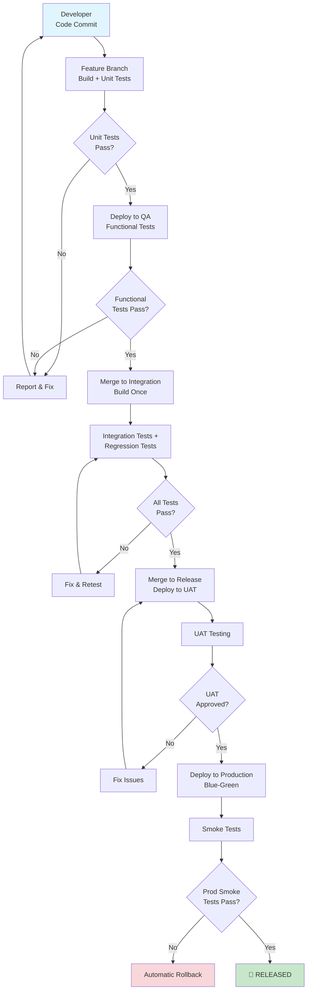

### The Three Pillars of CI/CD

**1. Continuous Integration (CI)**
- Developers merge code frequently
- Automated tests run immediately
- Fast feedback (minutes)
- Catch issues early

**2. Continuous Deployment (CD)**
- Automated promotion through environments
- Same code → multiple tests → production
- Reliable, repeatable process
- Eliminates manual errors

**3. Continuous Testing (CT)**
- Tests at every stage
- Multiple test types (unit, integration, regression, UAT)
- Quality gates prevent bad code
- Confidence in releases

### ROI of CI/CD Pipeline

| Metric | Before | After | Improvement |
|--------|--------|-------|-------------|
| **Release Frequency** | 1/month | 5+/day | 150x |
| **Lead Time** | 2-3 weeks | 1-2 hours | 100x faster |
| **Deployment Success Rate** | 70% | 98% | 28% improvement |
| **Time to Fix Production Issues** | 4 hours | 15 minutes | 16x faster |
| **Manual Work** | 80% | 10% | 70% reduction |

### Critical Success Factors

1. **Automation Everything**
   - Build, test, deploy all automated
   - No manual gates (except UAT approval)

2. **Quality at Every Stage**
   - Unit tests (developers)
   - Functional tests (QA)
   - Integration tests (QA)
   - Regression tests (QA)

3. **Fast Feedback**
   - Build: < 5 minutes
   - Tests: < 10 minutes
   - Deployment: < 5 minutes
   - Total: < 20 minutes

4. **Infrastructure as Code**
   - Everything version controlled
   - Infrastructure repeatable
   - Environments identical

5. **Monitoring & Observability**
   - Know what's happening
   - Quick rollback capability
   - Health dashboards

### Challenges & Solutions

| Challenge | Solution |
|-----------|----------|
| **Slow tests** | Run tests in parallel, optimize expensive tests |
| **Flaky tests** | Fix root causes, improve test reliability |
| **Deployment failures** | Automate deployments, use blue-green pattern |
| **Too many environments** | Standardize, use containers for consistency |
| **Manual approvals** | Automate gates, require automated tests to pass first |

---

## Conclusion

The CI/CD pipeline and microservice lifecycle model presented in this document provides:

✅ **Rapid Development** - Features reach production in hours, not weeks

✅ **High Quality** - Multiple automated tests catch issues before production

✅ **Lower Risk** - Smaller changes easier to rollback, automated deployments reduce errors

✅ **Team Efficiency** - Developers focus on features, automation handles testing/deployment

✅ **Scalability** - Same pipeline works for 1 or 100 microservices

✅ **Customer Value** - Features deployed faster, bugs fixed faster, feedback loop shorter

### Next Steps for Implementation

1. **Week 1-2**: Set up version control branching strategy
2. **Week 2-3**: Create base Docker images (security-hardened)
3. **Week 3-4**: Implement Jenkins/GitHub Actions pipeline
4. **Week 4-5**: Set up automated testing framework
5. **Week 5-6**: Configure environment promotion (DEV→QA→UAT→PROD)
6. **Week 6-7**: Train teams on CI/CD workflow
7. **Week 7-8**: Monitor and optimize pipeline

### Key Metrics to Track

- Pipeline success rate (goal: > 95%)
- Deployment frequency (goal: 5+/day)
- Lead time from commit to production (goal: < 2 hours)
- Mean time to recovery (goal: < 15 minutes)
- Production incidents (goal: < 5% of deployments)
- Code coverage (goal: > 80%)

---

**This CI/CD pipeline model is the foundation of DevOps excellence, enabling fast, reliable, and safe software delivery.**
