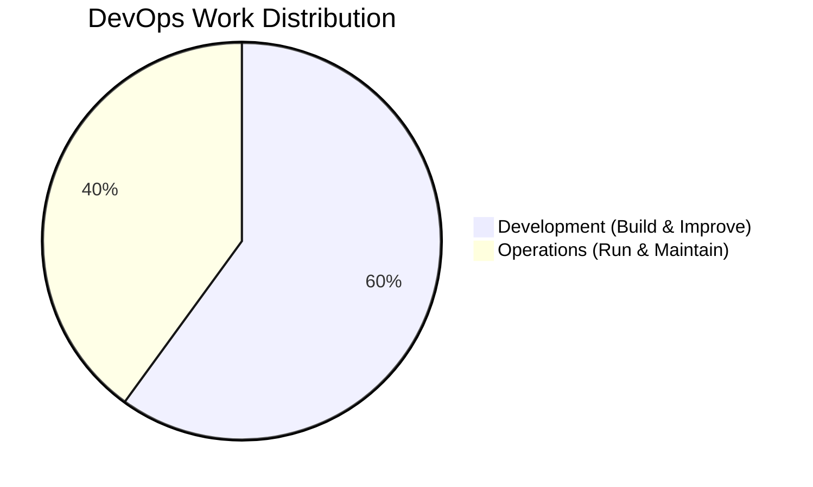
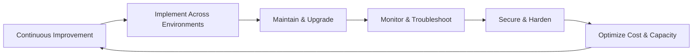
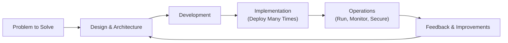
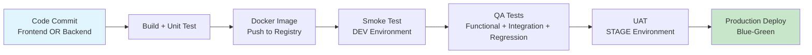
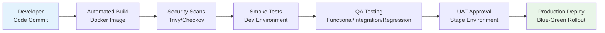

As Devops engineer we have to do the following things:

1. Development Responsibilities:

    a. 60% of the time we have to do development work.

    b. New devlopment (scratch to production)

    c. Enhancements (existing applications)

    d. New problems (existing applications)

2. Operational Responsibilities:

    a. 40% of the time we have to do support work.

    b. Rollout

    c. Maintenance (backup/upgrade/patching)

    d. Monitoring (troubleshooting/scale)

    e. Security (iam/trivy/checkov)

    f. Cost optimization (cost/resource utilization)

<!-- ================= HERO SUMMARY (TOP OF README) ================= -->

### 👨‍💻 DevOps & SRE – What This Role Really Does

DevOps work in this role is roughly split into **60% development** and **40% operations**.

Development is not just writing scripts once. It means **designing, building, implementing, and continuously improving automation** around infrastructure, CI/CD, observability, and reliability.

Operations is about **rolling out that automation across environments, maintaining systems, monitoring end‑to‑end, securing infrastructure, and optimizing cost & capacity**.

### DevOps Responsibilities Overview

```mermaid
graph TB
    A["DevOps Engineer<br/>60% Development + 40% Operations"]
    
    A --> B["Development Responsibilities<br/>60%"]
    A --> C["Operational Responsibilities<br/>40%"]
    
    B --> B1["Build Automation"]
    B --> B2["Infrastructure as Code"]
    B --> B3["CI/CD Pipelines"]
    B --> B4["Monitoring & Observability"]
    B --> B5["Reliability Engineering"]
    
    C --> C1["Rollout & Deployment"]
    C --> C2["Maintenance<br/>Backup/Upgrade/Patching"]
    C --> C3["Monitoring &<br/>Troubleshooting"]
    C --> C4["Security<br/>IAM/Scanning"]
    C --> C5["Cost Optimization"]
    
    B1 --> B1a["Scripts & Tooling"]
    B1 --> B1b["Environment Provisioning"]
    B1 --> B1c["Day-2 Operations"]
    
    B2 --> B2a["Terraform Modules"]
    B2 --> B2b["Infrastructure Templates"]
    B2 --> B2c["Version Control"]
    
    B3 --> B3a["Build Pipeline"]
    B3 --> B3b["Test Automation"]
    B3 --> B3c["Deploy Pipeline"]
    
    B4 --> B4a["Metrics & Logs"]
    B4 --> B4b["Alerts & Dashboards"]
    B4 --> B4c["Tracing & APM"]
    
    B5 --> B5a["Auto-scaling"]
    B5 --> B5b["Self-healing Systems"]
    B5 --> B5c["High Availability"]
    
    C1 --> C1a["QA/Staging/Prod"]
    C1 --> C1b["Blue-Green Deploy"]
    C1 --> C1c["Canary Rollouts"]
    
    C2 --> C2a["Backup & Recovery"]
    C2 --> C2b["Resource Upgrades"]
    C2 --> C2c["Dependency Updates"]
    
    C3 --> C3a["Infrastructure Health"]
    C3 --> C3b["Application Health"]
    C3 --> C3c["Incident Response"]
    
    C4 --> C4a["Access Control"]
    C4 --> C4b["Vulnerability Scanning"]
    C4 --> C4c["Compliance"]
    
    C5 --> C5a["Right-sizing"]
    C5 --> C5b["Resource Utilization"]
    C5 --> C5c["Cost Analysis"]
    
    style A fill:#e3f2fd
    style B fill:#c8e6c9
    style C fill:#ffe0b2
```



---

<!-- ================= HIGH-LEVEL VISUAL OVERVIEW ================= -->

### ⚙️ DevOps Work Distribution

| Area | Share of Work | What It Covers                                                                 |
|--------------------------|--------------|-------------------------------------------------------------------------------|
| **Development**          | **60%**      | Building automation, IaC, pipelines, monitoring, self‑healing, reliability   |
| **Operations**           | **40%**      | Rollout, maintenance, monitoring, security, cost optimization                |



<!-- ================= DETAILED SECTION: WHAT I DO AS DEVOPS ================= -->

### 🚀 What DevOps Work Actually Looks Like

DevOps responsibilities span both development and operations, but a major part of the impact comes from building and evolving automation, not just running manual tasks.

1️⃣ Development Responsibilities (≈ 60%)
Development here means end‑to‑end engineering of automation and systems, not just writing a script once.

What gets developed

Automation scripts & tooling

Environment provisioning

Day‑2 operations (backup, cleanup, patching, rotation)

CI/CD pipelines

Build, test, quality gates, security scans, artifact promotion, deployment

Infrastructure as Code (IaC)

Terraform modules, reusable blueprints, environment templates

Deployment & release frameworks

Blue‑green, canary, rolling deployments, promotion workflows

Monitoring & alerting solutions

Metrics, logs, traces, SLOs, alerts, dashboards

Reliability & self‑healing systems

Auto‑recovery, auto‑scaling, health checks, circuit‑breakers

How development is done

New development (scratch → production)

Understand requirements

Design architecture & workflows

Implement automation (Terraform, Ansible, Docker, Kubernetes, CI/CD, etc.)

Integrate with infra, pipelines, monitoring, security

Enhancements to existing solutions

Add new features and workflows

Improve performance, reliability, and developer experience

Refactor for reuse, standardization, and maintainability

Solving new problems over time

New environments, new compliance needs, new scaling patterns

For each new challenge, either build a new solution or extend existing ones

Development is a continuous lifecycle:

Initial build

Continuous maintenance

Version and dependency upgrades

Feature additions and performance tuning

Reliability and stability improvements

2️⃣ Operational Responsibilities (≈ 40%)
Once automation and systems exist, operations is about using them reliably in real environments and keeping everything healthy over time.

a. Rollout & Implementation
Use existing automation (e.g., Terraform, Ansible, pipelines) to roll out:

QA environments

Staging / pre‑production

Production infrastructure and services

Ensure idempotent, repeatable, environment‑specific deployments

b. Maintenance (Backup / Upgrade / Patching)
Backups & recovery readiness

Regular backups of critical data and configurations

Restore tests and DR planning

Resource & capacity upgrades

Scale machines (for example, from 2 GB to 4 GB) based on load

Resize storage and tune performance parameters

Application & platform upgrades

Upgrade app versions, runtimes, OS images, databases, and dependencies

Security patching

OS security patches

Middleware / runtime vulnerability fixes

c. Monitoring & Troubleshooting
End‑to‑end monitoring, depending on what is rolled out:

Machines and infrastructure

Kubernetes clusters and workloads

CI/CD pipelines and jobs

Databases and storage

Application performance and user experience

Debugging & stability

Capacity bottlenecks

Performance degradation

Application‑level failures

Infrastructure instability

Ensure that issues are detected early and resolved quickly.

d. Security
Access control & IAM

Principle of least privilege for users, services, and machines

Vulnerability management

Image scanning (e.g., Trivy)

IaC scanning (e.g., Checkov, tfsec)

Dependency and library vulnerabilities

Security compliance & hardening

Patching

Configuration baselines

Protecting production systems and sensitive data

e. Cost Optimization
Right‑sizing resources

Avoid over‑provisioned machines and unused capacity

Optimizing utilization

Scale‑to‑zero where possible

Auto‑scaling for peak vs off‑peak

Continuous review of spend vs usage

Identify waste

Use automation to enforce cost guardrails

### 🔁 End‑to‑End DevOps Lifecycle

DevOps work is about owning the full lifecycle, not just individual tasks.



- **Build** – Design and develop automation, pipelines, and infrastructure as code
- **Implement** – Roll out automation consistently across QA, staging, and production
- **Maintain** – Backup, upgrade, patch, and evolve systems as requirements grow
- **Monitor** – Observe health, performance, and reliability across the stack
- **Secure** – Enforce IAM, patching, vulnerability management, and compliance
- **Optimize** – Continuously refine for cost, scale, and efficiency

<!-- ================= PROJECT / CASE-STUDY SNIPPET ================= -->

### 📂 How This Looks in Real Projects

In real projects, this DevOps role typically includes:

Designing and building Terraform + Ansible stacks for multi‑env infrastructure

Creating CI/CD pipelines for build, test, security scanning, and automated deployments

Automating environment rollouts for QA, staging, and production

Setting up monitoring, logging, and alerting for infra and applications

Implementing security controls (IAM, image/IaC scanning, patch management)

Continuously improving reliability, performance, and cost efficiency based on real usage

Devops project lifecycle:
How does a overall lifecycle work in a project?
## 🔄 DevOps Project Lifecycle

In a real DevOps project, you are not just “doing tasks” assigned by a manager.  
You are **solving a problem end‑to‑end** by designing, building, implementing, and running a complete solution.

Almost every DevOps project can be broken into **four major phases**:

1. **Design & Architecture**
2. **Development**
3. **Implementation (Deploy Many Times)**
4. **Operations (Run & Maintain)**

---

### 🧠 1. Design & Architecture

Every project starts with a **problem to solve**.

Before touching Terraform, Ansible, or Kubernetes, the first responsibility is to **design the solution**:

- Understand the **problem statement** and constraints
- Decide on the **overall architecture** (cloud‑native, hybrid, on‑prem, etc.)
- Choose **best practices** and standards:
  - High availability, scalability, resilience
  - Observability: logging, metrics, tracing
  - Security by design (network, IAM, secrets, compliance)
- Identify **which automation is needed**:
  - Terraform / CloudFormation for infrastructure
  - Ansible for configuration management
  - Docker & Kubernetes for container orchestration
  - CI/CD pipeline tools for build & deployment

At this stage you answer:

> “What is the best way to solve this problem using automation and cloud‑native design?”

---

### 💻 2. Development

Once the architecture is clear, the next step is to **develop the solution**.

This is where you convert design into working automation:

- **Infrastructure as Code**
  - Write Terraform modules / stacks for networks, compute, storage, databases, Kubernetes, etc.
- **Configuration & provisioning**
  - Use Ansible or similar tools to configure OS, middleware, app dependencies
- **Containers & orchestration**
  - Create Docker images, Kubernetes manifests / Helm charts
- **CI/CD pipelines**
  - Build → Test → Scan → Package → Deploy → Verify
- **Monitoring & alerting**
  - Dashboards, alerts, log pipelines, tracing

You can use **AI tools** to speed up boilerplate, but:
- You still own the **architecture**, **integration**, and **production readiness** of the solution.

---

### 🚀 3. Implementation (Develop Once, Deploy Many Times)

After development, the next phase is **implementation**.

You **write the code once**, but **use it many times** across environments:

- Use the same Terraform/Ansible/Kubernetes code to:
  - Roll out **QA** environments
  - Provision **staging / pre‑production**
  - Deploy to **production**
- Ensure that the automation is:
  - **Reusable** (parameterized, modular)
  - **Idempotent** (safe to run multiple times)
  - **Environment‑aware** (separate configs for dev/QA/stage/prod)

This is often summarized as:

> **“Develop once, deploy many times.”**

Your focus here is **rollout**:
- Running the automation reliably
- Handling environment‑specific configs
- Coordinating with teams (QA, developers, operations, security)

---

### 🛡️ 4. Operations (Day‑to‑Day Run & Care)

Once the system is in place, ongoing **operations** begin.

Operations cover all **day‑to‑day activities** that keep the system healthy:

- **Maintenance**
  - Backups and restore testing
  - Resource upgrades (for example, 2 GB → 4 GB memory)
  - Application and dependency upgrades
  - Patch management (OS, runtimes, libraries)
- **Monitoring & troubleshooting**
  - Monitor infrastructure, Kubernetes, databases, and applications
  - Detect and resolve capacity bottlenecks and performance issues
  - Handle application‑level failures and infra incidents
- **Security**
  - IAM and access control
  - Vulnerability scanning (images, IaC, dependencies)
  - Hardening and compliance
- **Continuous improvement**
  - Feed production learnings back into design and code
  - Improve reliability, performance, and cost over time

Operations ensure that **what you built continues to work, scale, and stay secure**.

---

### 📊 Visual View of the DevOps Project Lifecycle



**Lifecycle Explanation:**

- **Design & Architecture** – Decide how to solve the problem using best practices and cloud‑native patterns
- **Development** – Build the automation: IaC, pipelines, containers, monitoring
- **Implementation** – Use the same code to roll out multiple environments
- **Operations** – Maintain, monitor, secure, and continuously improve the system

---

### 🗓️ **Day 0: Planning & Design** (Primary Task)

**What it is**: Everything you do **before** writing any code.

**Your responsibilities**:
- **Problem analysis** – Understand the exact problem and constraints
- **Architecture design** – Create cloud-native, scalable, secure solution
- **Automation planning** – Map out Terraform, Ansible, Kubernetes, CI/CD needs
- **Best practices** – HA, observability, security, cost optimization from Day 0
- **Environment strategy** – Define QA/staging/prod rollouts

**Deliverable**: Architecture diagrams, tech decisions, automation roadmap

Day 0 Checklist:
✅ Problem defined
✅ Architecture designed
✅ Tools selected (Terraform/Ansible/K8s/CI-CD)
✅ Security & best practices planned
✅ Multi-env rollout strategy ready


---

### 🛠️ **Day 1: Development & Implementation**

**What it is**: Build once → Deploy many times.

**Your responsibilities**:
- **Develop automation** – IaC, pipelines, containers, monitoring
- **Test locally** – Validate code works before rollout
- **Run automation** across environments:

Same code → QA env → Staging env → Production env


**Key principle**: *"Write once, run everywhere"* – Idempotent, parameterized, reusable code.

Day 1 Checklist:
✅ IaC code written & tested
✅ CI/CD pipelines working
✅ Containers built & scanned
✅ Monitoring configured
✅ Deployed to QA/Staging/Prod

---

### 🔄 **Day 2: Operations & Maintenance** (Ongoing)

**What it is**: Everything after "it works" – keeping it working forever.

**Your responsibilities**:
- **Monitor** – Infra, apps, pipelines, K8s, databases (metrics/logs/traces)
- **Maintain** – Backups, upgrades, patching, scaling (2GB→4GB)
- **Troubleshoot** – Capacity issues, perf degradation, app failures
- **Secure** – IAM, vulnerability scans (Trivy/Checkov), compliance
- **Improve** – Reliability, cost, performance based on production data

Day 2 Checklist (Forever):
🔄 Monitoring dashboards active
🔄 Alerts & auto-remediation working
🔄 Regular backups & DR tested
🔄 Security scanning automated
🔄 Cost optimization reviews


---

### 🎯 **Day 0 → Day 2 in One Visual**

```mermaid
flowchart TD
    Start["🚀 New Project Initiated"] --> D0["📋 DAY 0: Planning & Design"]
    
    D0 --> D0A["🔍 Requirements Analysis"]
    D0A --> D0B["🏗️ Architecture Design<br/>(microservices, cloud-native)"]
    D0B --> D0C["🛠️ Tool Selection<br/>(Terraform, Ansible, Kubernetes, CI/CD)"]
    D0C --> D0D["📊 Environment Strategy<br/>(QA, Staging, Prod)"]
    D0D --> D0E["🔒 Security & HA Planning<br/>(IAM, monitoring, compliance)"]
    D0E --> D0F["✅ Day 0 Complete<br/>(Design Document Ready)"]
    
    D0F --> D1["⚙️ DAY 1: Development & Implementation"]
    
    D1 --> D1A["💻 Write IaC Code<br/>(Terraform for infra)"]
    D1A --> D1B["🔄 Build CI/CD Pipelines<br/>(Git → Build → Deploy)"]
    D1B --> D1C["🐳 Container Strategy<br/>(Dockerfile, Docker registry)"]
    D1C --> D1D["📦 First Deployment<br/>QA Environment"]
    D1D --> D1E["🧪 Automated Testing<br/>(unit, integration, functional)"]
    D1E --> D1F["📈 Deploy to Staging"]
    D1F --> D1G["✅ Deploy to Production<br/>(Same Code, Different Params)"]
    D1G --> D1H["✅ Day 1 Complete<br/>(Running in Production)"]
    
    D1H --> D2["🔧 DAY 2: Operations & Maintenance"]
    
    D2 --> D2A["📊 Monitoring & Alerting<br/>(Prometheus, DataDog, CloudWatch)"]
    D2A --> D2B["🔄 Log Aggregation & Analysis<br/>(ELK, Loki, Splunk)"]
    D2B --> D2C["🚨 On-Call & Incident Response<br/>(PagerDuty, runbooks)"]
    D2C --> D2D["🔒 Security Scanning<br/>(Trivy, Checkov, IAM audits)"]
    D2D --> D2E["💾 Backup & Disaster Recovery<br/>(automated, tested)"]
    D2E --> D2F["📈 Performance Optimization<br/>(resource scaling, caching)"]
    D2F --> D2G["💰 Cost Management<br/>(AWS/GCP/Azure billing review)"]
    D2G --> D2H["🔁 Continuous Improvement<br/>(Feedback loop → Day 0)"]
    
    D2H --> Loop{"Issues or<br/>New Features?"}
    Loop -->|Yes| D0
    Loop -->|No| D2H
    
    style D0 fill:#e3f2fd,stroke:#1976d2,stroke-width:3px
    style D1 fill:#f3e5f5,stroke:#7b1fa2,stroke-width:3px
    style D2 fill:#fff3e0,stroke:#f57c00,stroke-width:3px
    style Start fill:#e8f5e9,stroke:#388e3c,stroke-width:2px


This framework shows recruiters you understand:

- ✅ Strategic thinking (Day 0 planning)
- ✅ Engineering skills (Day 1 automation)
- ✅ Production ownership (Day 2 operations)
- ✅ Full lifecycle responsibility


## 🌐 Real-World Example: 3-Tier Web App (Netflix-Style)

Let's make this **concrete** for recruiters. Here's how the **Day 0 → Day 2 lifecycle** applies to a **3-tier microservices web application** (think Netflix, but simplified).

**The Product**: A streaming web app with **3 microservices layers**:

Frontend (React/Node.js) → Backend (Spring Boot/Java) → Database (MySQL)


---

### 🏗️ **Architecture Overview**

```
┌─────────────────┐ ┌──────────────────┐ ┌─────────────────┐
│ Frontend        │ │ Backend          │ │ MySQL           │
│ React.js        │◄──►│ Spring Boot      │◄──►│ Structured DB   │
│ (Node.js)       │ │ (Java)           │ │                 │
└─────────────────┘ └──────────────────┘ └─────────────────┘
│ │ │
▼ ▼ ▼
[EC2/Fargate/K8s] [EC2/Fargate/K8s] [RDS/Aurora MySQL]
```

**Each layer = 1 microservice** (scalable independently):
- **Frontend**: React.js UI (Node.js runtime) – User interface, authentication
- **Backend**: Spring Boot (Java) – Business logic, APIs, orchestration  
- **Database**: MySQL – User data, content metadata, transactions

---

### 🔄 **Day 0 → Day 2 Applied to This 3-Tier App**

#### 🗓️ **Day 0: Planning & Design**

Problem: "Build a scalable streaming web app like Netflix"

**Architecture Decisions**:

Infra: AWS (or OCI/AKS/GCP)
├── Frontend: React → Node.js → EC2/Fargate/EKS
├── Backend: Spring Boot → EC2/Fargate/EKS
├── Database: MySQL → RDS/Aurora (Multi-AZ, read replicas)
├── Networking: VPC → ALB → Security Groups → WAF
├── CI/CD: GitHub Actions/Jenkins → Blue-green deployments
├── Monitoring: CloudWatch/Prometheus/Grafana
└── Security: IAM roles, Secrets Manager, parameter store


**Key Design Questions Answered**:
- ✅ **Cloud-native**: Containers (Docker) + Orchestration (EKS)
- ✅ **HA**: Multi-AZ RDS, ALB across AZs, auto-scaling groups
- ✅ **Security**: Least privilege IAM, WAF, encryption at rest/transit
- ✅ **Observability**: Centralized logging, metrics, tracing

---

#### 🛠️ **Day 1: Development & Implementation**

**What you build** (Terraform + Helm + Jenkins):

├── terraform/
│ ├── vpc.tf # Networking (public/private subnets)
│ ├── eks.tf # EKS cluster + node groups
│ ├── rds.tf # MySQL RDS (Multi-AZ)
│ ├── alb.tf # Application Load Balancer
│ └── iam.tf # Roles, policies, service accounts
├── helm/
│ ├── frontend/ # React/Node deployment + service
│ ├── backend/ # Spring Boot deployment + service
│ └── mysql-init/ # Database initialization
└── jenkins/
├── frontend-pipeline.yaml
├── backend-pipeline.yaml
└── db-migration.yaml


**"Write once, deploy many"**:

terraform apply -var env=qa
terraform apply -var env=staging
terraform apply -var env=prod


---

#### 🔄 **Day 2: Operations**

**Ongoing responsibilities**:

Daily Operations Checklist:
✅ ALB health checks passing (frontend/backend)
✅ RDS CPU/Memory/Connections healthy
✅ EKS nodes auto-scaling correctly
✅ Jenkins pipelines succeeding (deployments)
✅ CloudWatch alarms quiet (no critical alerts)
✅ Security scans clean (Trivy/Checkov)
✅ Cost: Right-sized instances, unused resources terminated


**Monitoring Dashboard Example**:

┌─────────────────────┐ ┌─────────────────────┐ ┌──────────────────┐
│ Frontend Metrics │ │ Backend Metrics │ │ RDS Metrics │
│ - Requests/sec │ │ - API Latency │ │ - CPU Usage │
│ - Error Rate │ │ - DB Connection │ │ - Connections │
│ - Pod Health │ │ - Memory Usage │ │ - Storage │
└─────────────────────┘ └─────────────────────┘ └──────────────────┘


---

### 🎯 **Why Recruiters Love This Example**

This **3-tier microservices app** demonstrates **everything** a senior DevOps engineer should know:

| **Skill Area**       | **What You Did**                                                                 |
|---------------------|----------------------------------------------------------------------------------|
| **IaC**             | Terraform for VPC/EKS/RDS/ALB – Multi-env, DRY principles                        |
| **Containers**      | Dockerized React/Node + Spring Boot → EKS deployments                            |
| **CI/CD**           | Jenkins/GitHub Actions – Build/test/scan/deploy across QA/staging/prod          |
| **Database**        | MySQL RDS – Multi-AZ, backups, read replicas, performance tuning                 |
| **Observability**   | CloudWatch/Prometheus – Metrics/logs/traces/SLOs across entire stack             |
| **Security**        | IAM roles, Secrets Manager, WAF, container/IaC scanning (Trivy/Checkov)          |
| **Operations**      | Auto-scaling, health checks, incident response, cost optimization                |

**Interview Answer**: *"I built a Netflix-style 3-tier streaming app using Terraform/EKS/Jenkins. Day 0: Designed cloud-native HA architecture. Day 1: Automated everything. Day 2: Owned monitoring/security/cost. Scaled to 10k users with 99.9% uptime."*

---

## 🧪 Continuous Delivery Pipeline for 3-Tier App

**Every microservice** (Frontend React/Node, Backend Spring Boot, MySQL schema changes) goes through the **same automated testing → delivery pipeline** across **4 environments**:

Dev → QA → Stage (Pre-Prod) → Production


---

### 🔬 **Testing Lifecycle (Per Microservice)**

Each microservice follows this **automated progression**:

Unit Test ──(Dev)──> Smoke Test ──(Dev)──> Functional ──(QA)──>
Integration ──(QA)──> Regression ──(QA)──> UAT ──(Stage)──> Production


| **Test Type**         | **Who**      | **Environment** | **Purpose**                                      |
|-----------------------|--------------|-----------------|--------------------------------------------------|
| **Unit Testing**      | Developers   | Local           | Individual code functions work                   |
| **Smoke Test**        | DevOps       | **Dev**         | Build works, basic functionality passes          |
| **Functional**        | QA           | **QA**          | Specific feature changes validated               |
| **Integration**       | QA           | **QA**          | New code + existing code works together          |
| **Regression**        | QA           | **QA**          | Nothing broke in unaffected areas                |
| **UAT**               | Stakeholders | **Stage**       | Production-like validation (customer ready)      |
| **Production Deploy** | DevOps       | **Production**  | Live customer traffic                            |

---

### 🏗️ **4 Environments Strategy**

```
┌─────────────┐ ┌─────────────┐ ┌─────────────────┐ ┌──────────────┐
│ DEV         │ │ QA          │ │ STAGE (Pre-Prod)│ │ PRODUCTION   │
│             │ │             │ │                 │ │              │
│ - Dev work  │───▶│ - Functional│───▶│ - UAT           │───▶│ - Live users │
│ - Smoke test│ │ - Integration│ │ - Prod mirror   │ │ - Real traffic│
│             │ │ - Regression│ │ - Load testing  │ │              │
└─────────────┘ └─────────────┘ └─────────────────┘ └──────────────┘
```


**Each environment mirrors the full 3-tier stack**:

Frontend (React/Node) + Backend (Spring Boot) + MySQL (RDS)


---

### ⚡ **CI/CD Pipeline (Per Microservice)**

**Independent pipelines** for each microservice, triggered by Git commits:

```
Frontend Pipeline:                Backend Pipeline:
┌─────────────────┐             ┌──────────────────┐
│ Git Push        │             │ Git Push         │
│ React/Node code │             │ Spring Boot code │
└─────────┬───────┘             └─────────┬────────┘
          ▼                               ▼
┌─────────────────┐             ┌──────────────────┐
│ 1. Build        │             │ 1. Build         │
│ 2. Unit Test    │             │ 2. Unit Test     │
│ 3. Docker Image │             │ 3. Docker Image  │
└─────────┬───────┘             └─────────┬────────┘
          ▼                               ▼
┌─────────────────┐             ┌──────────────────┐
│ 4. Smoke Test   │ ───► DEV ───┤ 4. Smoke Test    │
└─────────┬───────┘             └─────────┬────────┘
          ▼                               ▼
┌─────────────────┐             ┌──────────────────┐
│ 5. QA Tests     │ ───► QA ────┤ 5. QA Tests      │
│ Func/Int/Reg    │             │ Func/Int/Reg     │
└─────────┬───────┘             └─────────┬────────┘
          ▼                               ▼
┌─────────────────┐             ┌──────────────────┐
│ 6. UAT Approval │ ──► STAGE ──┤ 6. UAT Approval  │
└─────────┬───────┘             └─────────┬────────┘
          ▼                               ▼
┌─────────────────┐             ┌──────────────────┐
│ 7. Prod Deploy  │ ──► PROD ───┤ 7. Prod Deploy   │
└─────────────────┘             └──────────────────┘
```

**Database changes** (MySQL schema/migrations) follow the **same pipeline**.

---

### 🎯 **Pipeline Automation (Jenkins/GitHub Actions)**

```yaml
# Example: Frontend Microservice Pipeline
stages:
  - name: Build & Test
    jobs:
      - build: docker build frontend:latest
      - test: npm test
      - smoke: deploy-to-dev && curl-health-check
  
  - name: QA Testing
    jobs:
      - deploy-qa: helm upgrade frontend qa-namespace
      - func-test: qa-run-functional-tests
      - integration: qa-run-integration-tests
      - regression: qa-run-regression-suite
  
  - name: UAT & Production
    jobs:
      - deploy-stage: helm upgrade frontend stage-namespace
      - uat-approval: manual-approval-required
      - deploy-prod: blue-green-deployment production
```

### 📊 Visual Pipeline Flow



| DevOps Skill          | What You Automated                                  |
| --------------------- | --------------------------------------------------- |
| Multi-Environment     | Dev/QA/Stage/Prod – Full stack in each              |
| Independent Pipelines | Frontend, Backend, DB changes deploy separately     |
| Test Automation       | Smoke → Functional → Integration → Regression → UAT |
| Production Safety     | Blue-green deployments, manual UAT gates            |
| Microservices         | Each service has independent CI/CD lifecycle        |

## 🔄 Continuous Delivery – Build → Test → Deploy

**Continuous Delivery** means **automating the journey** from developer code commits → QA testing → production deployment.

Developers write code **continuously**, but QA needs a **production-ready build** (not raw code). Your job as DevOps is to **automate this entire flow**.

---

### 🎯 **Core Activities You Automate**

```
Developer Code ───► BUILD ───► TEST ───► DEPLOY
(Git commit) (Docker) (QA) (Production)
```

| **Activity**    | **What You Do**                                                                 | **Tool**              |
|-----------------|---------------------------------------------------------------------------------|-----------------------|
| **Build**       | Convert code → Docker image → Push to registry                                 | Jenkins/GitHub Actions|
| **Test**        | Deploy build to QA env → Run automated tests → Approve promotion               | QA automation suite   |
| **Deploy**      | Promote approved build → Deploy to Stage → Blue-green to Production            | Helm/Terraform/ArgoCD |
| **Support**     | Monitor pipeline health, fix broken builds, optimize delivery velocity         | Observability stack   |

---

### 🔬 **From Code Commit to Production (Step-by-Step)**

```
DEV WRITES CODE → Git Push (React OR Spring Boot)

BUILD PIPELINE triggers automatically:
│
├─ BUILD: npm build / mvn package → Docker image
├─ SCAN: Trivy security scan → Checkov IaC scan
├─ SMOKE: Deploy to Dev → Health checks pass
└─ PUBLISH: Push image to ECR (tagged: v1.2.3)

UAT APPROVAL → Manual gate on Stage env

PRODUCTION DEPLOY → Blue-green rollout
```

**QA never sees raw code** – they get a **complete, tested Docker image** ready for their environment.

---

### ⚙️ **Pipeline Stages Visualized**



### 🏗️ Real Pipeline Code Example

```yaml
# GitHub Actions / Jenkins Pipeline
name: Continuous Delivery
on: [push]

jobs:
  build-test:
    runs-on: ubuntu-latest
    steps:
    - uses: actions/checkout@v3
    
    # BUILD
    - name: Build Docker Image
      run: docker build -t frontend:${{ github.sha }} .
    
    # SCAN
    - name: Security Scan
      uses: aquasecurity/trivy-action@master
      with:
        image-ref: frontend:${{ github.sha }}
    
    # SMOKE TEST
    - name: Deploy to Dev & Smoke Test
      run: |
        helm upgrade --install frontend dev-namespace \
          --set image.tag=${{ github.sha }}
        curl -f http://dev-frontend/health
    
    # PUBLISH
    - name: Push to Registry
      run: |
        docker tag frontend:${{ github.sha }} frontend:latest
        docker push frontend:latest

  qa-approval:
    needs: build-test
    runs-on: ubuntu-latest
    steps:
    - name: Deploy to QA
      run: helm upgrade frontend qa-namespace --set image.tag=${{ github.sha }}
    - name: Wait for QA Approval
      uses: trstringer/manual-approval@v1
```


