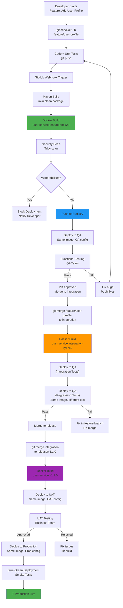

# Spring Boot Microservice: Container-Based Deployment

## Overview

This guide covers the complete containerization and deployment process for a single Spring Boot microservice. We'll apply the three-branch CI/CD strategy (feature → integration → release) with Docker container-based deployment.

---

## Part 1: Understanding Container-Based Deployment

### Why Container-Based Deployment?

**Traditional Deployment:**
```
Application Deployed on
Specific Machine
    ↓
Tied to that machine's OS, libraries, versions
    ↓
"Works on my machine" problem
    ↓
Difficult to scale (need more machines with same setup)
```

**Container-Based Deployment:**
```
Application Packaged in
Docker Container
    ↓
Self-contained with all dependencies
    ↓
Runs identically on any machine
    ↓
Easy to scale (spin up multiple containers)
```

### Benefits of Containerization

| Benefit | Description |
|---------|-------------|
| **Consistency** | Same container = same behavior everywhere (dev, QA, UAT, prod) |
| **Isolation** | Application doesn't interfere with host system |
| **Scalability** | Quickly create multiple copies and deploy to any machine |
| **Reproducibility** | Exact same environment guaranteed |
| **Deployment Speed** | Containers start in milliseconds |
| **Rollback** | Instantly revert to previous container version |

---

## Part 2: Docker Image Layers

### The Four Standard Layers

Every Docker image must contain these **4 minimum layers**:

```
┌─────────────────────────────────────────┐
│ Layer 4: Script Layer                   │
│ (Startup scripts, health checks)        │
├─────────────────────────────────────────┤
│ Layer 3: Application Layer              │
│ (JAR file, build artifacts)             │
├─────────────────────────────────────────┤
│ Layer 2: Framework Layer                │
│ (JRE, dependencies, libraries)          │
├─────────────────────────────────────────┤
│ Layer 1: OS Layer                       │
│ (Ubuntu, Alpine, CentOS, etc.)          │
└─────────────────────────────────────────┘
```

### Layer Descriptions

**1. OS Layer (Operating System)**
```
Purpose: Base operating system
Example: Ubuntu 20.04, Alpine Linux 3.16
Contains: Kernel, system utilities, package manager
Size: 50-200 MB depending on OS choice
```

**2. Framework Layer (Runtime & Dependencies)**
```
Purpose: Runtime environment for application
For Spring Boot: JRE (Java Runtime Environment)
Example: OpenJDK 17, Amazon Corretto 21
Contains: JVM, core libraries, version-specific tools
Size: 100-300 MB depending on JRE
```

**3. Application Layer (Build Artifacts)**
```
Purpose: Your actual application code
For Spring Boot: JAR file (compiled + packaged)
Contains: Spring Boot jar, built classes, resources
Size: 10-100 MB depending on application
Changes: Every build produces new JAR
```

**4. Script Layer (Automation Scripts)**
```
Purpose: Startup, shutdown, health checks
Examples:
  - entrypoint.sh (application startup)
  - health-check.sh (Kubernetes/container health)
  - cleanup.sh (graceful shutdown)
Size: 1-10 KB
```

### Example: Spring Boot Layers

```dockerfile
# Layer 1: OS Layer
FROM ubuntu:20.04

# Layer 2: Framework Layer (JRE)
RUN apt-get update && apt-get install -y \
    openjdk-17-jre-headless \
    ca-certificates

# Layer 3: Application Layer (JAR)
COPY target/user-service-1.0.0.jar /app/app.jar

# Layer 4: Script Layer
COPY scripts/entrypoint.sh /app/
RUN chmod +x /app/entrypoint.sh

ENTRYPOINT ["/app/entrypoint.sh"]
```

---

## Part 3: The Fifth Layer - Configuration (Runtime Injection)

### Why Configuration Is NOT in the Image

**Problem:** Different environments need different configurations

```
QA Environment:
  Database: qa-db.company.com
  Username: qa_user
  Password: qa_pass123
  SSL: false

Production Environment:
  Database: prod-db.aws.amazon.com
  Username: prod_user_encrypted
  Password: *encrypted*
  SSL: true
  Certificate: /etc/ssl/certs/prod.crt
```

**Solution:** Same image, different configuration at runtime

```
┌─────────────────────────────────────────┐
│ Docker Image (built once)               │
│ - OS Layer                              │
│ - Framework Layer (JRE)                 │
│ - Application Layer (JAR)               │
│ - Script Layer                          │
│ (NO configuration inside)               │
└─────────────────────────────────────────┘
         ↓
    ┌────┴────┬────────────┬────────────┐
    ↓         ↓            ↓            ↓
┌────────┐ ┌────────────┐ ┌──────────┐ ┌──────────┐
│QA      │ │Production  │ │UAT       │ │Dev       │
│Config  │ │Config      │ │Config    │ │Config    │
│qa-db   │ │prod-db     │ │uat-db    │ │dev-db    │
└────────┘ └────────────┘ └──────────┘ └──────────┘
```

### Configuration at Runtime

**Methods to Inject Configuration:**

1. **Environment Variables**
```bash
docker run \
  -e DB_HOST=prod-db.aws.amazon.com \
  -e DB_USER=prod_user \
  -e DB_PASSWORD=secret123 \
  user-service:v1.0.0
```

2. **ConfigMap (Kubernetes)**
```yaml
apiVersion: v1
kind: ConfigMap
metadata:
  name: user-service-config
data:
  application.properties: |
    spring.datasource.url=jdbc:mysql://prod-db:3306/userdb
    spring.datasource.username=prod_user
    spring.datasource.password=secret123
```

3. **Mounted Volumes**
```bash
docker run \
  -v /etc/config/app.properties:/app/config/app.properties \
  user-service:v1.0.0
```

4. **Spring Boot Properties File**
```bash
docker run \
  -e SPRING_CONFIG_LOCATION=/app/config/application.properties \
  user-service:v1.0.0
```

### Configuration Best Practices

```
✅ DO:
  - Store configuration outside image
  - Use environment variables for secrets
  - Use ConfigMaps for configuration files
  - Inject at container startup time

❌ DON'T:
  - Hardcode database URLs in image
  - Put passwords in Dockerfile
  - Build different images for each environment
  - Modify image after creation
```

---

## Part 4: Platform Base Image vs Application Image

### Two-Layer Image Architecture

```
┌─────────────────────────────────────────┐
│   APPLICATION IMAGE                     │
│   (Spring Boot Microservice)            │
│   user-service:v1.0.0                  │
├─────────────────────────────────────────┤
│ Layer 3: Application Layer (JAR)        │
│ Layer 4: Script Layer                   │
├─────────────────────────────────────────┤
│   BASE IMAGE (from Platform Team)       │
│   openjdk:17-slim                      │
├─────────────────────────────────────────┤
│ Layer 1: OS Layer (Ubuntu)              │
│ Layer 2: Framework Layer (JRE 17)       │
└─────────────────────────────────────────┘
```

### Platform Base Image (Responsibility: Platform Engineering Team)

**What:** Pre-built image with OS + Framework

**Examples:**
```
openjdk:17-slim
  - Ubuntu 20.04 (slim)
  - OpenJDK 17
  - Common Java libraries

openjdk:21-alpine
  - Alpine Linux (tiny)
  - OpenJDK 21
  - Minimal footprint

node:18-slim
  - Ubuntu 20.04 (slim)
  - Node.js 18
  - NPM, common packages
```

**When to Update:**
- New OS security patches
- New Java/Node.js versions
- Security vulnerabilities found
- License updates

**Versioning:**
```
openjdk:17-slim     ← Latest
openjdk:17.0.1-slim ← Specific version
```

### Application Image (Responsibility: DevOps Team)

**What:** Your microservice packaged with base image + JAR + scripts

**Dockerfile Example:**
```dockerfile
# Step 1: Use platform base image
FROM openjdk:17-slim

# Step 2: Add metadata
LABEL app="user-service"
LABEL version="1.0.0"

# Step 3: Create application directories
RUN mkdir -p /app/config /app/logs
RUN adduser --disabled-password --gecos '' appuser

# Step 4: Copy application layer (JAR)
COPY target/user-service-1.0.0.jar /app/

# Step 5: Copy script layer
COPY scripts/entrypoint.sh /app/
COPY scripts/health-check.sh /app/
RUN chmod +x /app/*.sh

# Step 6: Set working directory
WORKDIR /app

# Step 7: Set user (security best practice)
USER appuser

# Step 8: Expose port
EXPOSE 8080

# Step 9: Entry point
ENTRYPOINT ["./entrypoint.sh"]
```

### Why Two Layers?

**Scenario: Multiple Microservices**

```
Company has 3 Spring Boot microservices:
- user-service (Java 17)
- payment-service (Java 17)
- auth-service (Java 21)

Platform Team Builds:
  ✓ openjdk:17-slim-secure (once, reused)
  ✓ openjdk:21-slim-secure (once, reused)

DevOps Team Builds:
  ✓ user-service:v1.0.0
  ✓ user-service:v1.0.1
  ✓ payment-service:v1.0.0
  ✓ auth-service:v1.0.0
```

**Benefits:**
- Base image built once, reused many times
- OS + Java updates handled by platform team
- Faster application builds (cached base layer)
- Consistent across all microservices
- Security patches applied centrally

---

## Part 5: Spring Boot Microservice - Complete Example

### Project Structure

```
user-service-repo/
├── src/
│   ├── main/
│   │   ├── java/
│   │   │   └── com/company/
│   │   │       └── userservice/
│   │   │           ├── controller/
│   │   │           ├── service/
│   │   │           ├── repository/
│   │   │           └── UserServiceApplication.java
│   │   └── resources/
│   │       ├── application.properties (default)
│   │       ├── application-dev.properties
│   │       ├── application-qa.properties
│   │       ├── application-prod.properties
│   │       └── logback-spring.xml
│   └── test/
├── scripts/
│   ├── entrypoint.sh
│   ├── health-check.sh
│   └── build.sh
├── config/
│   ├── application.properties (template)
│   ├── logback-prod.xml
│   └── certificates/
│       └── prod.crt
├── .github/
│   └── workflows/
│       └── docker-build.yml
├── Dockerfile
├── pom.xml
├── README.md
└── .gitignore
```

### pom.xml (Build Configuration)

```xml
<?xml version="1.0" encoding="UTF-8"?>
<project xmlns="http://maven.apache.org/POM/4.0.0">
    <modelVersion>4.0.0</modelVersion>

    <groupId>com.company</groupId>
    <artifactId>user-service</artifactId>
    <version>1.0.0</version>
    <packaging>jar</packaging>

    <name>User Service</name>
    <description>Spring Boot Microservice for User Management</description>

    <parent>
        <groupId>org.springframework.boot</groupId>
        <artifactId>spring-boot-starter-parent</artifactId>
        <version>3.0.0</version>
    </parent>

    <properties>
        <java.version>17</java.version>
        <project.build.sourceEncoding>UTF-8</project.build.sourceEncoding>
    </properties>

    <dependencies>
        <!-- Spring Boot Starters -->
        <dependency>
            <groupId>org.springframework.boot</groupId>
            <artifactId>spring-boot-starter-web</artifactId>
        </dependency>
        
        <dependency>
            <groupId>org.springframework.boot</groupId>
            <artifactId>spring-boot-starter-data-jpa</artifactId>
        </dependency>

        <!-- Database -->
        <dependency>
            <groupId>mysql</groupId>
            <artifactId>mysql-connector-java</artifactId>
            <version>8.0.33</version>
        </dependency>

        <!-- Logging -->
        <dependency>
            <groupId>org.springframework.boot</groupId>
            <artifactId>spring-boot-starter-logging</artifactId>
        </dependency>

        <!-- Testing -->
        <dependency>
            <groupId>org.springframework.boot</groupId>
            <artifactId>spring-boot-starter-test</artifactId>
            <scope>test</scope>
        </dependency>
    </dependencies>

    <build>
        <plugins>
            <plugin>
                <groupId>org.springframework.boot</groupId>
                <artifactId>spring-boot-maven-plugin</artifactId>
                <configuration>
                    <executable>true</executable>
                </configuration>
            </plugin>
        </plugins>
    </build>
</project>
```

### Dockerfile

```dockerfile
# ============================================
# Stage 1: Build (Multi-stage build)
# ============================================
FROM maven:3.9-openjdk-17 AS builder

WORKDIR /build

# Copy pom.xml and download dependencies
COPY pom.xml .
RUN mvn dependency:go-offline -B

# Copy source code
COPY src ./src

# Build application (JAR file)
RUN mvn clean package -DskipTests

# ============================================
# Stage 2: Runtime (Final Image)
# ============================================
FROM openjdk:17-slim

# Metadata
LABEL app="user-service" \
      version="1.0.0" \
      maintainer="DevOps Team"

# Install additional tools
RUN apt-get update && apt-get install -y \
    curl \
    && rm -rf /var/lib/apt/lists/*

# Create application user (security best practice)
RUN groupadd -r appuser && useradd -r -g appuser appuser

# Create directories
RUN mkdir -p /app/config /app/logs && \
    chown -R appuser:appuser /app

# Copy JAR from builder
COPY --from=builder /build/target/user-service-*.jar /app/user-service.jar
RUN chown appuser:appuser /app/user-service.jar

# Copy scripts
COPY scripts/entrypoint.sh /app/
COPY scripts/health-check.sh /app/
RUN chmod +x /app/*.sh && \
    chown appuser:appuser /app/*.sh

# Set working directory
WORKDIR /app

# Switch to non-root user
USER appuser

# Expose port
EXPOSE 8080

# Health check
HEALTHCHECK --interval=30s --timeout=3s --start-period=10s --retries=3 \
    CMD ./health-check.sh

# Entry point
ENTRYPOINT ["./entrypoint.sh"]
```

### entrypoint.sh

```bash
#!/bin/bash

# Exit on error
set -e

echo "[$(date)] Starting User Service..."

# Set default values if not provided
SPRING_PROFILES_ACTIVE=${SPRING_PROFILES_ACTIVE:-default}
LOG_LEVEL=${LOG_LEVEL:-INFO}
JVM_MEMORY=${JVM_MEMORY:-512m}
JAVA_OPTS=${JAVA_OPTS:-}

# Log configuration
echo "[$(date)] Configuration:"
echo "  Profile: $SPRING_PROFILES_ACTIVE"
echo "  Log Level: $LOG_LEVEL"
echo "  JVM Memory: $JVM_MEMORY"
echo "  Database: $DB_HOST:$DB_PORT"

# Start application
exec java \
  -Xmx$JVM_MEMORY \
  -Xms256m \
  -XX:+UseG1GC \
  -XX:MaxGCPauseMillis=200 \
  $JAVA_OPTS \
  -Dspring.profiles.active=$SPRING_PROFILES_ACTIVE \
  -Dlogging.level.root=$LOG_LEVEL \
  -jar /app/user-service.jar
```

### health-check.sh

```bash
#!/bin/bash

# Health check for Kubernetes/Docker
# Verifies application is running and responsive

RESPONSE=$(curl -s -o /dev/null -w "%{http_code}" http://localhost:8080/actuator/health)

if [ "$RESPONSE" = "200" ]; then
    echo "Health check passed: Application is healthy"
    exit 0
else
    echo "Health check failed: HTTP $RESPONSE"
    exit 1
fi
```

### application.properties (Default)

```properties
# Spring Boot Configuration
spring.application.name=user-service

# Server Configuration
server.port=8080
server.servlet.context-path=/api/v1

# Database (will be overridden at runtime)
spring.datasource.url=jdbc:mysql://localhost:3306/userdb
spring.datasource.username=root
spring.datasource.password=password123
spring.datasource.driver-class-name=com.mysql.cj.jdbc.Driver

# JPA Configuration
spring.jpa.hibernate.ddl-auto=validate
spring.jpa.show-sql=false
spring.jpa.properties.hibernate.dialect=org.hibernate.dialect.MySQL8Dialect

# Logging
logging.level.root=INFO
logging.level.com.company.userservice=DEBUG

# Actuator (Health checks)
management.endpoints.web.exposure.include=health,info,metrics
management.endpoint.health.show-details=always
```

---

## Part 6: CI/CD Pipeline for Spring Boot Microservice

### Three Builds, Same Process

```
Feature Branch → Build Image 1 → Deploy to QA (Functional Test)
Integration Branch → Build Image 2 → Deploy to QA (Integration + Regression Test)
Release Branch → Build Image 3 → Deploy to UAT + Production
```

### GitHub Actions Workflow (docker-build.yml)

```yaml
name: Docker Build & Deploy

on:
  push:
    branches: [feature/*, integration, release/*]
  pull_request:
    branches: [integration, main]

jobs:
  build:
    runs-on: ubuntu-latest
    
    steps:
      - name: Checkout code
        uses: actions/checkout@v3
      
      - name: Set up JDK 17
        uses: actions/setup-java@v3
        with:
          java-version: '17'
          distribution: 'temurin'
          cache: maven
      
      - name: Build with Maven
        run: mvn clean package
      
      - name: Set Docker image tag
        run: |
          if [[ "${{ github.ref }}" == "refs/heads/feature/"* ]]; then
            echo "IMAGE_TAG=feature-${{ github.sha }}" >> $GITHUB_ENV
            echo "ENVIRONMENT=qa" >> $GITHUB_ENV
          elif [[ "${{ github.ref }}" == "refs/heads/integration" ]]; then
            echo "IMAGE_TAG=integration-${{ github.sha }}" >> $GITHUB_ENV
            echo "ENVIRONMENT=qa" >> $GITHUB_ENV
          elif [[ "${{ github.ref }}" == "refs/heads/release/"* ]]; then
            VERSION=$(echo ${{ github.ref }} | sed 's/refs\/heads\/release\///')
            echo "IMAGE_TAG=$VERSION" >> $GITHUB_ENV
            echo "ENVIRONMENT=uat" >> $GITHUB_ENV
          fi
      
      - name: Build Docker image
        run: |
          docker build \
            -t user-service:${{ env.IMAGE_TAG }} \
            -t user-service:latest \
            .
      
      - name: Scan Docker image (Trivy)
        run: |
          docker run --rm \
            -v /var/run/docker.sock:/var/run/docker.sock \
            aquasec/trivy:latest image \
            --severity HIGH,CRITICAL \
            user-service:${{ env.IMAGE_TAG }}
      
      - name: Push to Registry
        run: |
          echo "${{ secrets.DOCKER_REGISTRY_PASSWORD }}" | \
            docker login -u "${{ secrets.DOCKER_REGISTRY_USERNAME }}" --password-stdin
          docker push user-service:${{ env.IMAGE_TAG }}
      
      - name: Deploy to ${{ env.ENVIRONMENT }}
        run: |
          kubectl set image deployment/user-service \
            user-service=user-service:${{ env.IMAGE_TAG }} \
            -n ${{ env.ENVIRONMENT }}
          kubectl rollout status deployment/user-service -n ${{ env.ENVIRONMENT }}
      
      - name: Run Smoke Tests
        run: |
          curl -f http://user-service-${{ env.ENVIRONMENT }}:8080/api/v1/actuator/health || exit 1
      
      - name: Notify Status
        if: always()
        run: |
          echo "Build Status: ${{ job.status }}"
          echo "Image: user-service:${{ env.IMAGE_TAG }}"
```

---

## Part 7: Deploying Same Image to Different Environments

### QA Deployment (with QA configuration)

```bash
docker run \
  --name user-service-qa \
  --network app-network \
  -e SPRING_PROFILES_ACTIVE=qa \
  -e DB_HOST=qa-db.company.com \
  -e DB_PORT=3306 \
  -e DB_USERNAME=qa_user \
  -e DB_PASSWORD=qa_pass123 \
  -e LOG_LEVEL=DEBUG \
  -p 8081:8080 \
  user-service:v1.0.0
```

### Production Deployment (with Prod configuration)

```bash
docker run \
  --name user-service-prod \
  --network prod-network \
  -e SPRING_PROFILES_ACTIVE=prod \
  -e DB_HOST=prod-db.rds.amazonaws.com \
  -e DB_PORT=3306 \
  -e DB_USERNAME=prod_user_encrypted \
  -e DB_PASSWORD=${PROD_DB_PASSWORD} \
  -e LOG_LEVEL=WARN \
  -e ENABLE_SSL=true \
  -v /etc/ssl/certs/prod.crt:/app/config/prod.crt \
  -p 8080:8080 \
  user-service:v1.0.0
```

### Key Points

✅ **Same Image**: `user-service:v1.0.0` deployed to both QA and Prod
✅ **Different Configuration**: Environment variables injected at runtime
✅ **Immutable Artifact**: Image never changes after build
✅ **Build Once, Deploy Everywhere**: Reduces risk and ensures consistency

---

## Part 8: Platform Base Image Example

### Building Platform Base Image (Platform Team)

```dockerfile
# Dockerfile.base (created by Platform Team)
FROM ubuntu:20.04

# Update packages
RUN apt-get update && apt-get upgrade -y && \
    apt-get install -y \
    openjdk-17-jre-headless \
    ca-certificates \
    curl \
    && rm -rf /var/lib/apt/lists/*

# Security hardening
RUN useradd -m -u 1001 appuser && \
    chown -R appuser:appuser /home/appuser

# Health check tools
RUN apt-get update && apt-get install -y jq && \
    rm -rf /var/lib/apt/lists/*

LABEL maintainer="Platform Team" \
      base-os="ubuntu:20.04" \
      java-version="17"
```

### Building Base Image

```bash
docker build \
  -f Dockerfile.base \
  -t company-registry/java-base:17-ubuntu-20.04 \
  .

docker push company-registry/java-base:17-ubuntu-20.04
```

### Using Platform Base Image (DevOps Team)

```dockerfile
# Dockerfile (application)
FROM company-registry/java-base:17-ubuntu-20.04

# ... rest of application Dockerfile
COPY --from=builder /build/target/user-service-*.jar /app/
# ...
```

---

## Part 9: Complete Branching Strategy with Containerization



---

## Summary: Single Microservice Lifecycle

| Phase | Action | Artifact | Environment |
|-------|--------|----------|-------------|
| **Feature Branch** | Code → Build → Docker image | `user-service:feature-abc123` | QA (Functional) |
| **Integration Branch** | Merge → Build → Same process | `user-service:integration-xyz789` | QA (Integ + Regression) |
| **Release Branch** | Merge → Build → Versioned image | `user-service:v1.1.0` | UAT + Prod |
| **Production** | Blue-Green deploy | `user-service:v1.1.0` (with prod config) | Production |

**Key Principle: Build Once, Deploy Everywhere**
- One Docker image per build
- Same image deployed to QA, UAT, Prod
- Configuration injected at runtime
- Zero code/artifact changes between environments

---

## Real Interview Answer Example

> "In my project, I was responsible for containerizing and deploying a Spring Boot microservice. I started with understanding the four essential Docker image layers: OS, Framework (Java 17), Application (JAR), and Scripts. Rather than hardcoding configuration, I designed the system to inject environment-specific settings at runtime using environment variables and mounted volumes.
>
> We adopted a two-layer image architecture: the Platform team maintained the base image with Ubuntu 20.04 + Java 17, and my team built application-specific images on top of it. This allowed for faster builds and consistency across all microservices.
>
> For our CI/CD pipeline, we implemented the three-branch strategy where each branch triggered a Docker build: feature branch for QA functional testing, integration branch for regression testing, and release branch for production. Using the 'Build Once, Deploy Multiple Times' principle, the same Docker image was deployed to QA, UAT, and Production with different configuration files injected at runtime.
>
> This approach reduced deployment time from 30 minutes to 5 minutes, eliminated 'works in dev but not prod' issues, and enabled us to scale from 1 to 100 concurrent users without code changes."

